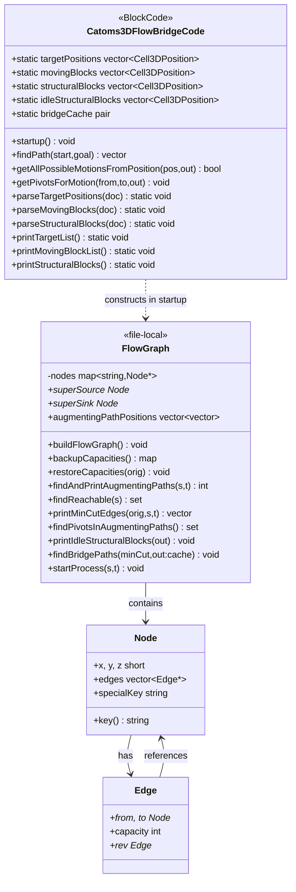
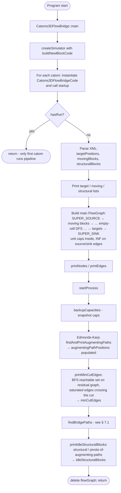
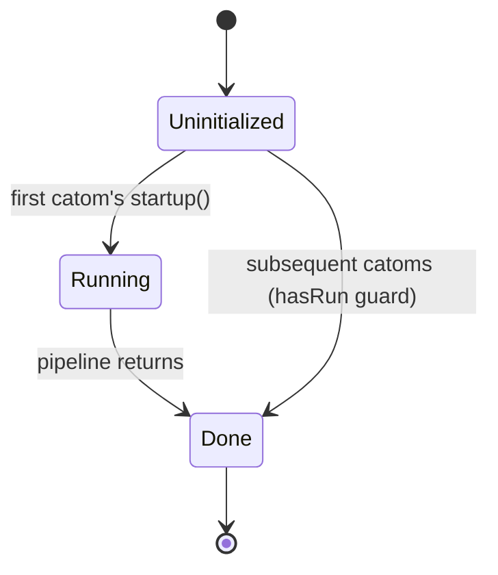
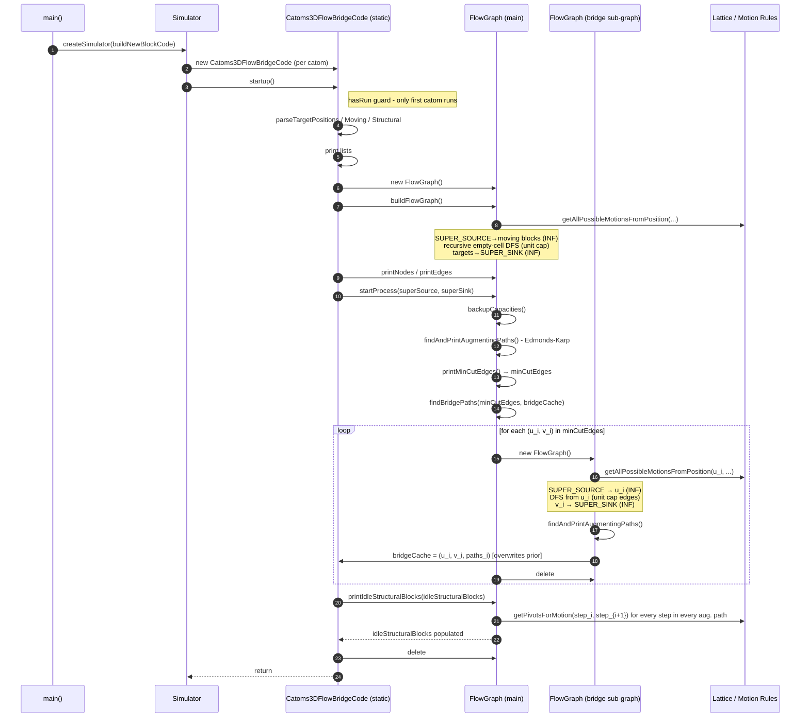
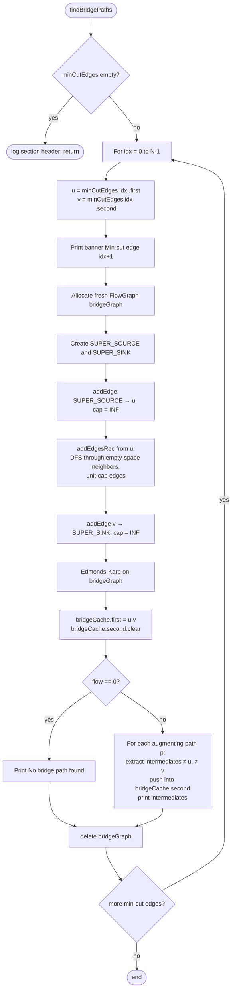
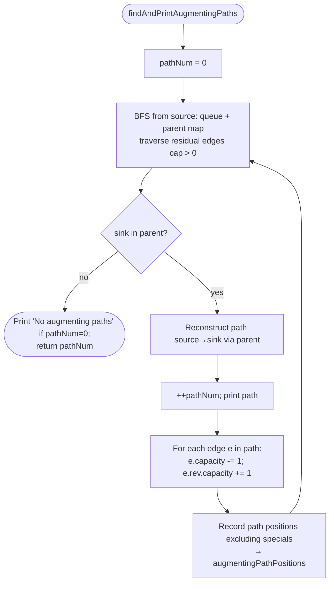
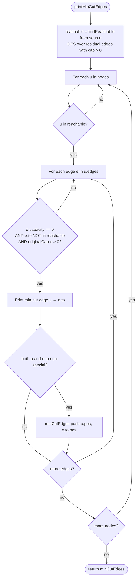
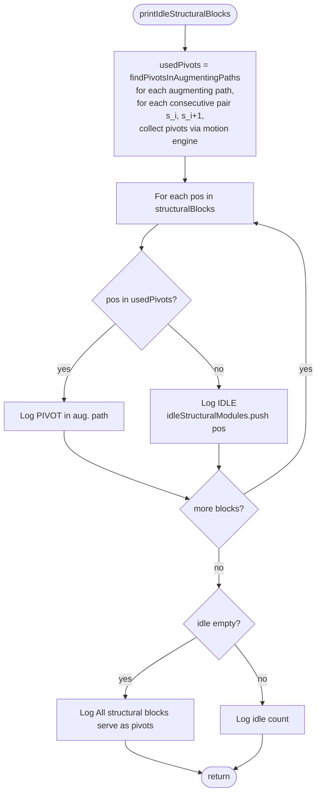

# Catoms3D Flow Bridge - Per-Edge Min-Cut Bridge Discovery

End-to-end design and process documentation for the
`Catoms_3D_Flow_Bridge` application.

> Scope. This document describes the algorithm as implemented in
> this directory: analytical max-flow / min-cut discovery, **per-edge**
> sub-flow-graph bridge enumeration, and idle-structural-block
> reporting. The application is **analysis-only** - it does not
> orchestrate module motion, does not perform articulation-point
> filtering, and does not verify the bridge by re-running max-flow.
> A separate application
> (`Catoms_3D_Flow_Bridge_Combined_Min_Cut_Edge`) extends this work
> with combined-corridor discovery and a forward/return state
> machine; that application is documented separately.

---

## Table of Contents

1. [Problem Statement](#1-problem-statement)
2. [Glossary](#2-glossary)
3. [System Architecture](#3-system-architecture)
4. [End-to-End Activity Diagram](#4-end-to-end-activity-diagram)
5. [State Diagram - Lifecycle](#5-state-diagram--lifecycle)
6. [Sequence Diagram - Per-Edge Bridge Discovery](#6-sequence-diagram--per-edge-bridge-discovery)
7. [Detailed Activity Diagrams per Stage](#7-detailed-activity-diagrams-per-stage)
8. [Full Pseudocode](#8-full-pseudocode)
9. [Software Engineering Documents](#9-software-engineering-documents)

---

## 1. Problem Statement

A 3D lattice of catoms contains:

- **Moving blocks** - modules that need to traverse the lattice from
  their starting positions to designated **target positions**.
- **Structural blocks** - stationary modules forming the lattice
  scaffolding; some serve as **pivots** for rotation-based motion.
- **Idle structural blocks** - structural blocks not required as
  pivots for any augmenting path; in principle, available to be
  relocated as bridge intermediates.

A max-flow / min-cut analysis on the motion graph (moving blocks →
target positions) finds the bottleneck - the smallest set of edges
whose removal disconnects sources from sinks. Each min-cut edge
`(u_i, v_i)` represents a saturated capacity-1 transition in the
motion graph.

**Goal of this application.** For *each* min-cut edge `(u_i, v_i)`
considered **independently**:

1. Build a dedicated sub-flow-graph that wires only `u_i` to a fresh
   `SUPER_SOURCE` (with infinite capacity) and only `v_i` to a fresh
   `SUPER_SINK`.
2. Expand reachable empty-space cells from `u_i` using the same FCC
   motion rules.
3. Run Edmonds–Karp on that sub-graph and enumerate the *bridge
   paths* - augmenting paths from `u_i` to `v_i` whose intermediate
   positions are empty cells.
4. Report each path. The intermediate positions of the **last**
   processed min-cut edge are retained in `bridgeCache`.

The application also reports which structural blocks are unused as
pivots (idle structural blocks). It does **not** move modules,
**not** verify the resulting flow, and **not** retain bridge
information across all min-cut edges - `bridgeCache` is singular and
gets overwritten each iteration.

---

## 2. Glossary

| Term | Definition |
|---|---|
| `Cell3DPosition` | Integer lattice coordinate `(x, y, z)` in the FCC grid. |
| **Moving block** | Source module - must reach a target position. |
| **Target position** | Sink cell - destination for some moving block. |
| **Structural block** | Stationary scaffold module declared in the XML `blockList`. |
| **Idle structural block** | Structural block not used as a pivot in any main-flow augmenting path. Informational only in this application. |
| **Pivot** | Structural block adjacent to a moving block that enables the moving block's rotation. |
| **SUPER_SOURCE / SUPER_SINK** | Special nodes in the FlowGraph. Main flow graph wires SUPER_SOURCE → all moving blocks and all target positions → SUPER_SINK with infinite capacity. |
| **Augmenting path** | A source→sink path with residual capacity > 0. |
| **Min-cut edge** | A saturated forward edge `(u, v)` such that `u` is reachable from the source in the residual graph but `v` is not. |
| **Sub-flow-graph (bridge graph)** | Per-edge graph built in `findBridgePaths`: SUPER_SOURCE → `u`, recursive expansion of empty-space reachability from `u`, `v` → SUPER_SINK. |
| **Bridge path** | An augmenting path in the sub-flow-graph; its **intermediate positions** are empty lattice cells through which a chain of modules could re-route around `(u, v)`. |
| **`bridgeCache`** | A single `((u, v), vector<vector<Cell3DPosition>>)` slot reused for every min-cut edge - at the end of the loop it holds *only the last edge's* bridge paths. |

---

## 3. System Architecture

### 3.1 Module Layout

```
applicationsSrc/Catoms_3D_Flow_Bridge/
├── Catoms3DFlowBridge.cpp       Entry point (createSimulator → BlockCode factory)
├── Catoms3DFlowBridgeCode.h     Class + static-state declarations
└── Catoms3DFlowBridgeCode.cpp   FlowGraph (file-local) + entire pipeline
```

### 3.2 Class / Struct Diagram



### 3.3 Static State Summary

| Member | Set by | Read by | Notes |
|---|---|---|---|
| `targetPositions` | `parseTargetPositions` | `buildFlowGraph` | Read from `<targetList>/<target>/<cell>` XML. |
| `movingBlocks` | `parseMovingBlocks` | `buildFlowGraph`, `parseStructuralBlocks` | Read from `<movingBlocks>/<block>`. |
| `structuralBlocks` | `parseStructuralBlocks` | `printIdleStructuralBlocks` | Excludes positions that also appear in `movingBlocks`. |
| `idleStructuralBlocks` | `printIdleStructuralBlocks` (out-param) | (not consumed by anything else in this app) | Reported only; not used downstream. |
| `bridgeCache` | `findBridgePaths` (overwritten each iter) | (not consumed by anything else in this app) | Holds only the last min-cut edge's data after the loop. |

> Note. The `Catoms3DFlowBridgeCode` instance is a `BlockCode` -
> simulator instantiates one per catom. `startup()` is gated by a
> static `hasRun` flag, so only the **first** catom's `startup`
> executes the pipeline.

---

## 4. End-to-End Activity Diagram



---

## 5. State Diagram - Lifecycle

The per-edge application has **no run-time state machine** - it
runs a single linear pipeline inside `startup()` and never reacts to
motion events. The only state-like distinction is the one-shot
`hasRun` guard.



> Compare with the combined-bridge application, whose orchestration
> drives a three-state machine `IDLE ↔ FORWARD ↔ RETURN` across many
> motion events. Here, no motion is scheduled and no events are
> handled.

---

## 6. Sequence Diagram - Per-Edge Bridge Discovery

Interaction between the static `Catoms3DFlowBridgeCode`, the
file-local `FlowGraph`, and the simulator's `Lattice` / motion-rules
helpers, for one invocation of `startup()`.



---

## 7. Detailed Activity Diagrams per Stage

### 7.1 Per-Edge Bridge Discovery (`findBridgePaths`)



> Behavioural note. Lines L→N2 inside the loop unconditionally
> overwrite `bridgeCache` on every iteration. At return time
> `bridgeCache` reflects only the **last** processed min-cut edge.
> See § 9.7 for the implication.

### 7.2 Edmonds–Karp on a (Sub-)Flow Graph



### 7.3 Min-Cut Extraction



### 7.4 Idle Structural Block Reporting



---

## 8. Full Pseudocode

The pseudocode below mirrors the implementation routine-for-routine.
Lines tagged `[!]` denote log output; lines tagged `[B]` denote
behavioural points where the per-edge approach differs from the
combined-bridge approach (referenced in § 9).

### 8.1 Top-level entry

```
function Catoms3DFlowBridgeCode::startup():
    if hasRun: return
    hasRun = true

    doc = Simulator::getConfigDocument()
    parseTargetPositions(doc)
    parseMovingBlocks(doc)
    parseStructuralBlocks(doc)         // excludes positions also in movingBlocks
    [!] printTargetList / printMovingBlockList / printStructuralBlocks

    fg = new FlowGraph()
    fg.buildFlowGraph()
    [!] fg.printNodes(); fg.printEdges()

    fg.startProcess(fg.superSource, fg.superSink)
    fg.printIdleStructuralBlocks(out: idleStructuralBlocks)

    delete fg
    return
```

### 8.2 FlowGraph::startProcess

```
function FlowGraph::startProcess(source, sink):
    originalCap = backupCapacities()                  // snapshot every edge.cap
    pathNum     = findAndPrintAugmentingPaths(source, sink)
    minCutEdges = printMinCutEdges(originalCap, source, sink)
    findBridgePaths(minCutEdges, /*out*/ Catoms3DFlowBridgeCode::bridgeCache)
    // restoreCapacities(originalCap)  - present in source as commented-out
```

### 8.3 Build main flow graph

```
function FlowGraph::buildFlowGraph():
    superSource = getOrCreateSpecial("SUPER_SOURCE")
    superSink   = getOrCreateSpecial("SUPER_SINK")
    edgeVisited, nodeVisited = ∅, ∅

    // Internal recursive expansion (lambda inside the function).
    function addEdgesRec(fromNode, fromPos):
        if fromNode.key in nodeVisited: return
        nodeVisited.add(fromNode.key)
        reachable = Catoms3DFlowBridgeCode::getAllPossibleMotionsFromPosition(fromPos)
        for toPos in reachable:
            toNode = getOrCreateNode(toPos)
            if (fromNode.key, toNode.key) ∉ edgeVisited:
                addEdge(fromNode, toNode, capacity = 1)
                edgeVisited.add((fromNode.key, toNode.key))
            addEdgesRec(toNode, toPos)

    for start in movingBlocks:
        s = getOrCreateNode(start)
        if (SUPER_SOURCE, s) ∉ edgeVisited:
            addEdge(superSource, s, capacity = INF)
            edgeVisited.add(...)
        addEdgesRec(s, start)

    for t in targetPositions:
        n = getOrCreateNode(t)
        if (n, SUPER_SINK) ∉ edgeVisited:
            addEdge(n, superSink, capacity = INF)
            edgeVisited.add(...)
```

### 8.4 Edmonds–Karp

```
function FlowGraph::findAndPrintAugmentingPaths(source, sink) -> int:
    pathNum = 0
    [!] "--- Edmonds-Karp Augmenting Paths ---"
    loop:
        parent = ∅
        queue.push(source); parent[source] = nullptr
        while queue nonempty and sink ∉ parent:
            u = queue.pop()
            for e in u.edges:
                if e.capacity > 0 and e.to ∉ parent:
                    parent[e.to] = e
                    queue.push(e.to)
        if sink ∉ parent: break

        path = reconstruct(source → sink, via parent)
        ++pathNum
        [!] printAugmentingPath(source, path, pathNum)
        for e in path: e.capacity -= 1; e.rev.capacity += 1     // unit augmentation
        positions = [e.from.pos for e in path if e.from non-special]
        if last path edge .to non-special: positions.append(...)
        augmentingPathPositions.append(positions)

    if pathNum == 0: [!] "No augmenting paths found."
    return pathNum
```

### 8.5 Min-cut extraction

```
function FlowGraph::printMinCutEdges(originalCap, source, _sink) -> [(u,v)]:
    reachable = findReachable(source)             // residual graph reachability
    cut = ∅
    [!] "--- Min-Cut Edges (from reachable to non-reachable) ---"
    for u in nodes:
        if u ∉ reachable: continue
        for e in u.edges:
            if e.capacity == 0 and e.to ∉ reachable and originalCap[e] > 0:
                if not printed.has((u.key, e.to.key)):
                    [!] "Min-cut edge: u → e.to"
                    if u and e.to are both non-special:
                        cut.append((u.pos, e.to.pos))
    return cut

function FlowGraph::findReachable(source) -> set:
    visited = {source}; stack = [source]
    while stack nonempty:
        u = stack.pop()
        for e in u.edges:
            if e.capacity > 0 and e.to ∉ visited:
                visited.add(e.to); stack.push(e.to)
    return visited
```

### 8.6 [B] Per-edge bridge discovery

```
function FlowGraph::findBridgePaths(minCutEdges, /*out*/ bridgeCache):
    [!] "--- Bridge Paths for Min-Cut Edges ---"

    for idx, (uPos, vPos) in enumerate(minCutEdges):
        [!] "=== Min-cut edge {idx+1}: uPos -> vPos ==="

        // [B] Fresh sub-flow-graph PER min-cut edge - no edges blocked.
        bg = new FlowGraph()
        bg.superSource = bg.getOrCreateSpecial("SUPER_SOURCE")
        bg.superSink   = bg.getOrCreateSpecial("SUPER_SINK")
        edgeVisited, nodeVisited = ∅, ∅

        function addEdgesRec(fromNode, fromPos):
            if fromNode.key in nodeVisited: return
            nodeVisited.add(fromNode.key)
            reachable = Catoms3DFlowBridgeCode::getAllPossibleMotionsFromPosition(fromPos)
            for toPos in reachable:
                toNode = bg.getOrCreateNode(toPos)
                if (fromNode.key, toNode.key) ∉ edgeVisited:
                    bg.addEdge(fromNode, toNode, 1)
                    edgeVisited.add(...)
                addEdgesRec(toNode, toPos)

        // SUPER_SOURCE → u  (DFS expansion from u over reachable empty space)
        uNode = bg.getOrCreateNode(uPos)
        bg.addEdge(bg.superSource, uNode, INF)
        addEdgesRec(uNode, uPos)

        // v → SUPER_SINK
        vNode = bg.getOrCreateNode(vPos)
        bg.addEdge(vNode, bg.superSink, INF)

        // Run EK on the sub-graph.
        flow = bg.findAndPrintAugmentingPaths(bg.superSource, bg.superSink)

        // [B] Overwrite the singular bridgeCache slot for this edge.
        bridgeCache.first = (uPos, vPos)
        bridgeCache.second.clear()

        if flow == 0:
            [!] "  No bridge path found for this min-cut edge."
        else:
            [!] "  {flow} bridge path(s) found."
            for p, path in enumerate(bg.augmentingPathPositions):
                bridgePath = []
                hasBridge = false
                [!] "  Bridge {p+1} intermediate positions:"
                for pos in path:
                    if pos != uPos and pos != vPos:
                        [!] " {pos}"
                        hasBridge = true
                        bridgePath.append(pos)
                if not hasBridge: [!] " (direct edge, no intermediates)"
                bridgeCache.second.append(bridgePath)

        delete bg
```

### 8.7 Idle-structural-block reporting

```
function FlowGraph::printIdleStructuralBlocks(/*out*/ idleStructuralModules):
    usedPivots = findPivotsInAugmentingPaths()
    [!] "--- Idle Structural Blocks (not pivot in any augmenting path) ---"
    for pos in structuralBlocks:
        if pos in usedPivots:
            [!] "[PIVOT in aug. path] pos"
        else:
            [!] "[IDLE]               pos"
            idleStructuralModules.append(pos)
    if idleStructuralModules empty:
        [!] "All structural blocks serve as pivots in augmenting paths."
    else:
        [!] "{n} idle structural block(s) available for bridge building."

function FlowGraph::findPivotsInAugmentingPaths() -> set:
    pivots = ∅
    for path in augmentingPathPositions:
        for i = 0 .. path.size-2:
            Catoms3DFlowBridgeCode::getPivotsForMotion(path[i], path[i+1], pivots)
    return pivots
```

### 8.8 Lattice helpers (motion + pivot resolution)

```
function getAllPossibleMotionsFromPosition(pos, /*out*/ reachable):
    mod = lattice.getBlock(pos)
    if mod exists:
        for nb in lattice.getFreeNeighborCells(pos):
            if mod.canMoveTo(nb): reachable.append(nb)
        return reachable nonempty
    // No block at pos - derive candidates via active neighbors' motion rules.
    for nbPos in lattice.getActiveNeighborCells(pos):
        neigh = lattice.getBlock(nbPos)
        conFrom = neigh.getConnectorId(pos)
        links  = MotionRules.getValidMotionListFromPivot(neigh, conFrom, …)
        for link in links:
            destPos = neigh.getNeighborPos(link.getConToID(), ...)
            reachable.append(destPos)
    return reachable nonempty

function getPivotsForMotion(fromPos, toPos, /*out*/ pivots):
    mod = lattice.getBlock(fromPos)
    if mod:
        pairs = MotionEngine.findPivotLinkPairsForTargetCell(mod, toPos)
        for (pivot, _) in pairs: if pivot: pivots.add(pivot.position)
    else:
        for nbPos in lattice.getActiveNeighborCells(fromPos):
            neigh = lattice.getBlock(nbPos)
            for link in MotionRules.getValidMotionListFromPivot(neigh, neigh.getConnectorId(fromPos), …):
                if neigh.getNeighborPos(link.getConToID()) == toPos:
                    pivots.add(nbPos)
```

### 8.9 XML parsing

```
function parseTargetPositions(doc):
    root = doc.RootElement
    for <cell position="x,y,z"> in root/targetList/target/cell*:
        targetPositions.append((x,y,z))

function parseMovingBlocks(doc):
    for <block position="x,y,z"> in root/movingBlocks/block*:
        movingBlocks.append((x,y,z))

function parseStructuralBlocks(doc):
    for <block position="x,y,z"> in root/blockList/block*:
        if (x,y,z) ∉ movingBlocks: structuralBlocks.append((x,y,z))
```

---

## 9. Software Engineering Documents

### 9.1 Invariants

| # | Invariant | Where enforced |
|---|---|---|
| I1 | Exactly one catom executes the pipeline (`startup` is gated by `hasRun`). | `startup()` |
| I2 | `movingBlocks` and `structuralBlocks` are disjoint. | `parseStructuralBlocks()` |
| I3 | The main FlowGraph has INF-capacity edges from `SUPER_SOURCE` to every moving block and from every target to `SUPER_SINK`; all interior edges are unit-capacity. | `buildFlowGraph()` |
| I4 | `originalCap` records every edge's original capacity before Edmonds–Karp modifies residuals. | `backupCapacities()` |
| I5 | A `(u, v)` pair is added to the min-cut output only if both endpoints are non-special grid nodes. | `printMinCutEdges()` |
| I6 | Each iteration of `findBridgePaths` allocates and frees a fresh `FlowGraph`. | `findBridgePaths()` |
| I7 | Inside the sub-flow-graph, no edges are blocked - the per-edge sub-graph can re-traverse other min-cut edges if reachable. | `findBridgePaths()` |
| I8 | `bridgeCache.first` and `bridgeCache.second` are overwritten on every iteration; the final value reflects only the last min-cut edge. | `findBridgePaths()` |
| I9 | `idleStructuralBlocks ⊆ structuralBlocks` and is disjoint from any pivot used in main flow. | `printIdleStructuralBlocks()` |
| I10 | No module is moved and no scheduler event is posted during the pipeline. | (whole module) |

### 9.2 Edge cases

| Case | Behavior |
|---|---|
| `targetPositions` empty | No `targetNode → SUPER_SINK` edges; max-flow = 0; `minCutEdges` empty; `findBridgePaths` is a no-op section. |
| `movingBlocks` empty | No `SUPER_SOURCE → start` edges; flow graph degenerate; max-flow = 0; same as above. |
| `minCutEdges` empty | `findBridgePaths` prints only the section header; `bridgeCache` retains whatever it held before (default-constructed). |
| Sub-flow-graph EK returns 0 | Log `"No bridge path found for this min-cut edge."`; `bridgeCache.second` left empty for this edge (and persists if it is the last edge). |
| Sub-flow-graph augmenting path is a *direct* `u → v` edge with no intermediates | Logged `(direct edge, no intermediates)`; an empty `bridgePath` is still pushed into `bridgeCache.second`. |
| `v_i` not reachable in the sub-graph DFS from `u_i` | `vNode` is created on demand (`getOrCreateNode(vPos)`); EK simply finds no augmenting path and reports flow = 0 for this edge. |
| `structuralBlocks` empty | `printIdleStructuralBlocks` logs nothing inside the loop; final message `"All structural blocks serve as pivots…"` is **not** triggered (the empty / non-empty branch is only taken when `idleStructuralModules` would be empty - and the loop never runs). |
| Multiple catoms instantiated | All subsequent `startup()` calls short-circuit on `hasRun`. |
| Re-running the simulator | Each process starts with fresh static state. |

### 9.3 Complexity

Let
`V = #lattice cells reachable in the main flow graph`,
`E = O(V)` (FCC max-degree 12, constant per node),
`F = max-flow value`,
`N = |minCutEdges|`,
`V_i, E_i = size of sub-flow-graph for edge i`.

| Stage | Time | Space |
|---|---|---|
| XML parsing | `O(|targets| + |moving| + |structural|)` | `O(...)` |
| Build main FlowGraph | `O(V + E)` | `O(V + E)` |
| Edmonds–Karp on main graph | `O(V · E · F)` | shared with main graph |
| Min-cut extraction | `O(V + E)` | `O(V)` |
| **Per-edge bridge discovery (total)** | `Σ_{i=1..N} O(V_i · E_i · F_i)` | one sub-graph at a time, freed after each iter |
| Idle-block reporting | `O(|aug paths| · max-aug-len · pivot-rule-eval)` | `O(\|pivots\|)` |

> Asymptotic vs. combined approach. The per-edge total scales with
> `N` (number of min-cut edges); the combined approach (separate
> application) replaces it with a single `O(V · E · F)` sub-graph
> run, at the cost of zero-capping all `N` edges inside that sub-graph.

### 9.4 Logging & observability

The implementation emits structured `cout` blocks that capture every
analytical decision:

- `--- Flow Graph Nodes ---` and `--- Flow Graph Edges (including reverse) ---`
  print the main graph after construction.
- `--- Edmonds-Karp Augmenting Paths ---` lists every augmenting
  path found on the main graph, then each sub-graph.
- `--- Min-Cut Edges (from reachable to non-reachable) ---` lists
  every saturated edge crossing the cut.
- `--- Bridge Paths for Min-Cut Edges ---` opens the per-edge
  enumeration; each edge gets a `=== Min-cut edge k: u -> v ===`
  banner, followed by `Bridge p intermediate positions: …` lines.
- `--- Idle Structural Blocks (not pivot in any augmenting path) ---`
  marks each structural block as `[PIVOT in aug. path]` or
  `[IDLE]`, then summarises the count.
- `Found path from a to b` / `No path found from a to b` lines from
  the standalone `findPath` BFS helper (used by callers, not by the
  pipeline itself in this application).

### 9.5 Build & run

```
# 1. Build the simulator core libraries.
$ cd simulatorCore/src
$ make -j$(nproc)

# 2. Build the application.
$ cd ../../applicationsSrc/Catoms_3D_Flow_Bridge
$ make

# 3. Run with an XML config.
$ ../../applicationsBin/Catoms_3D_Flow_Bridge/Catoms3DFlowBridge -f <config>.xml
```

Post-run checks:

1. Each min-cut edge produces a `=== Min-cut edge k: u -> v ===`
   banner.
2. For each such edge, either `Bridge p intermediate positions: …`
   lines are emitted or `No bridge path found for this min-cut edge.`
3. The idle-blocks section reports a `[PIVOT]` or `[IDLE]`
   classification for every entry of `structuralBlocks`.
4. The application exits cleanly without any motion events.

### 9.6 Limitations & non-goals

This application is intentionally **analysis-only**. It does not:

- Filter idle modules by motion-blockage or articulation-point
  status. Every structural block is classified solely by whether it
  appears as a pivot in some main-flow augmenting path.
- Verify the bridge by re-running Edmonds–Karp after a hypothetical
  placement. There is no `verifyBridge` step.
- Schedule any rotation events. The `findPath` and motion-rule
  helpers exist but are not invoked from the pipeline.
- Retain bridges for more than one min-cut edge: `bridgeCache` is a
  single `(pair, vector<vector>)` slot, overwritten each iteration.
- Combine min-cut edges into a single corridor. Each edge is treated
  independently; sub-graph DFS in `findBridgePaths` may freely
  traverse positions that lie on *other* min-cut edges, so the
  resulting paths do **not** guarantee a global detour.

### 9.7 Known behavioural caveats

| # | Observation | Impact |
|---|---|---|
| C1 | `bridgeCache` is overwritten every iteration of `findBridgePaths`. | Only the last min-cut edge's bridge paths are retrievable after `startProcess` returns. The textual log is the only durable record of all edges. |
| C2 | The sub-graph allows augmenting paths to pass *through* other min-cut edges' endpoints. | Bridge paths reported for edge `i` may rely on cells that themselves belong to another min-cut edge `j ≠ i`, so simultaneous placement of all paths is not guaranteed feasible. |
| C3 | `restoreCapacities` is implemented but **commented out** in `startProcess`. | After EK, the main graph's residuals are not reverted. Since the graph is freed at the end of `startup`, this is benign in the current pipeline, but precludes re-querying the main graph after `startProcess`. |
| C4 | `findPath` and `getPivotsForMotion` are public helpers exposed in the header but only the latter is called inside this application (by `findPivotsInAugmentingPaths`). | Header surface is broader than what the application uses. |
| C5 | `checkBridgeCache` exists in the source but is commented out. | No verification step at runtime. |

### 9.8 Relationship to the combined-bridge application

The companion application
`Catoms_3D_Flow_Bridge_Combined_Min_Cut_Edge` extends this design as
follows (see that application's `DOCUMENTATION.md` for details):

| Aspect | Per-edge (this app) | Combined (companion app) |
|---|---|---|
| Sub-graph count | `N` (one per min-cut edge) | `1` |
| Output of discovery | `bridgeCache` (singular, last-edge only) | `combinedBridge: {U_first, V_last, candidatePaths}` |
| Endpoint selection | each `(u_i, v_i)` literally | `U_first` / `V_last` chosen by BFS distance from / to super-source/sink |
| Blocking of other min-cut edges in sub-graph | none - re-traversal possible | every `(u_i, v_i)` zero-capped |
| Idle-module filtering | not performed | `isModuleBlocked` + articulation-point check |
| Forward/return orchestration | none | full state machine, multi-round filling, BFS-shortest return |
| Verification | none | re-runs EK and reports flow delta |
| Pipeline kind | analysis only | analysis + simulation |

---

*End of document.*
