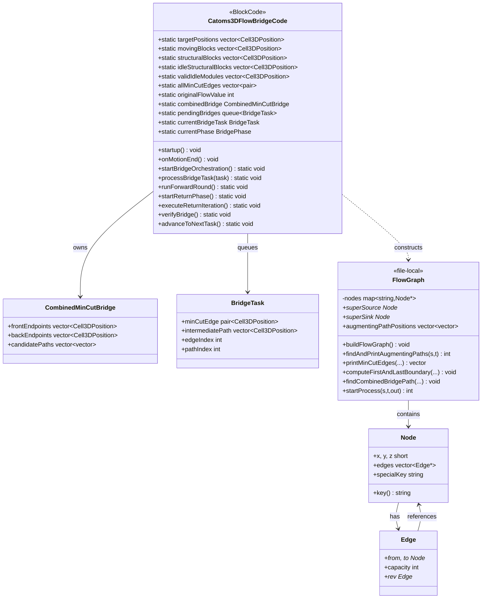
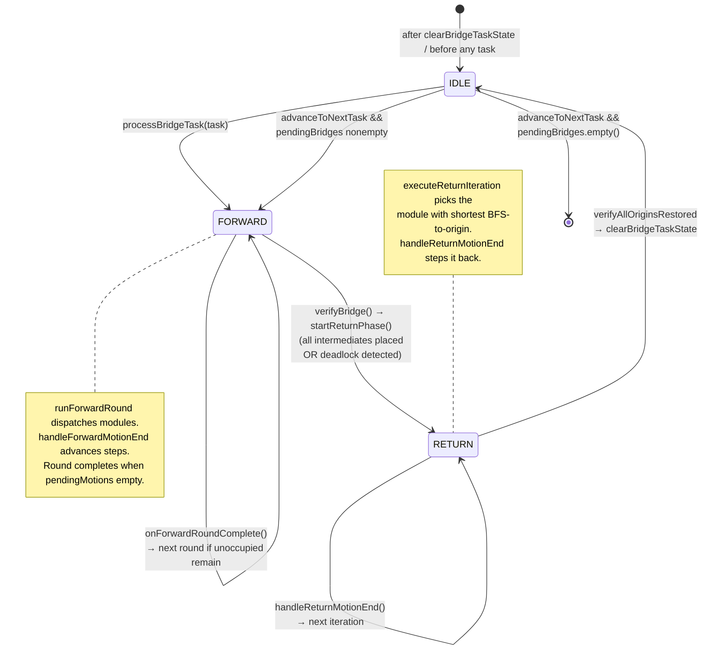
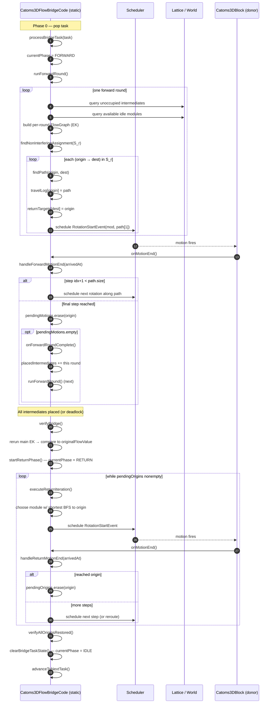
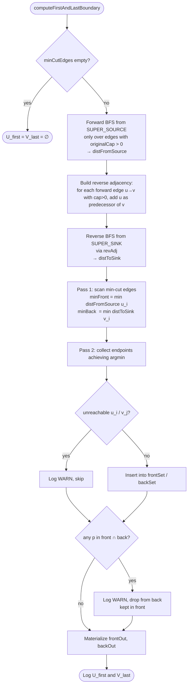
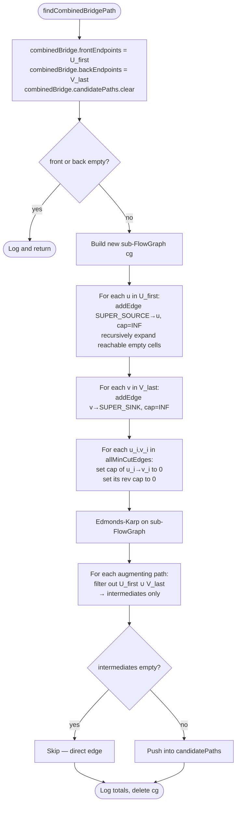
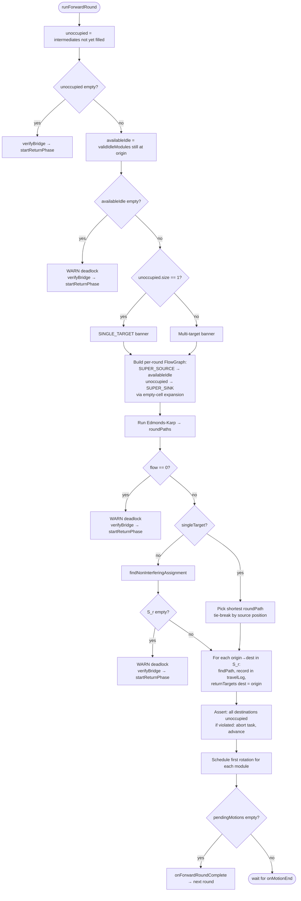

# Catoms3D Flow Bridge — Combined Min-Cut Edge

End-to-end design and process documentation for the
`Catoms_3D_Flow_Bridge_Combined_Min_Cut_Edge` application.

> Scope. The document describes the algorithm in its current
> (combined min-cut) form. The earlier per-edge bridge-discovery
> approach is referenced only in the comparison section
> (§ 9.4) to explain the design rationale.

---

## Table of Contents

1. [Problem Statement](#1-problem-statement)
2. [Glossary](#2-glossary)
3. [System Architecture](#3-system-architecture)
4. [End-to-End Activity Diagram](#4-end-to-end-activity-diagram)
5. [State Diagram — BridgePhase](#5-state-diagram--bridgephase)
6. [Sequence Diagram — Bridge Orchestration](#6-sequence-diagram--bridge-orchestration)
7. [Detailed Activity Diagrams per Stage](#7-detailed-activity-diagrams-per-stage)
8. [Full Pseudocode](#8-full-pseudocode)
9. [Software Engineering Documents](#9-software-engineering-documents)

---

## 1. Problem Statement

A 3D lattice of catoms contains:

- **Moving blocks** — modules that must traverse the lattice from
  their starting positions to designated **target positions**.
- **Structural blocks** — stationary modules that form the lattice
  scaffolding and may act as **pivots** during rotation-based motion.
- **Idle structural blocks** — structural blocks that are *not*
  required as pivots for any augmenting path in the main max-flow
  solution. These are candidates to be relocated.

A max-flow / min-cut analysis on the motion graph (moving blocks →
target positions) finds the *bottleneck* — the smallest set of edges
whose removal disconnects sources from sinks. Each min-cut edge
`(u_i, v_i)` represents a position pair through which only one
module can pass per cycle.

**Goal.** Increase the cross-section of the bottleneck by *bridging*
it with idle modules: place idle structural blocks into empty
lattice cells that, after placement, form an alternative corridor
around the bottleneck. The new corridor must:

1. Detour around **every** original min-cut edge simultaneously
   (not just one).
2. Re-use only modules that are safe to move (non-blocked,
   non-articulation).
3. Restore each donor module to its original idle position once the
   corridor is filled.

The output is observable as an increased max-flow value when
Edmonds–Karp is re-run on the modified lattice.

---

## 2. Glossary

| Term | Definition |
|---|---|
| `Cell3DPosition` | Integer lattice coordinate `(x, y, z)` in the FCC grid. |
| **Moving block** | Source module — must reach a target position. |
| **Target position** | Sink cell — final destination for some moving block. |
| **Structural block** | Stationary scaffold module. |
| **Idle structural block** | Structural block not used as a pivot in any main-flow augmenting path. |
| **Valid idle module** | Idle structural block that is (a) not motion-blocked and (b) not an articulation point of the structure. |
| **Pivot** | Structural block adjacent to a moving block; required for the moving block's rotation step. |
| **Augmenting path** | A source→sink path with residual capacity > 0 in the flow graph. |
| **Min-cut edge** | An edge `(u, v)` saturated by max-flow such that `u` is reachable from the source in the residual graph but `v` is not. Its removal disconnects source from sink. |
| **U_first** | The subset of min-cut edge sources `u_i` having the *smallest* BFS distance from `SUPER_SOURCE` on the original-capacity graph. |
| **V_last** | The subset of min-cut edge sinks `v_i` having the *smallest* reverse-BFS distance to `SUPER_SINK`. |
| **Combined bridge** | A single sub-flow-graph through empty space that wires all `U_first` to a single `SUPER_SOURCE`, all `V_last` to a single `SUPER_SINK`, and zero-caps every original min-cut edge so augmenting paths physically detour around the entire bottleneck corridor. |
| **Candidate path** | An intermediate-only sequence of empty cells produced by Edmonds–Karp on the combined sub-graph. |
| **BridgeTask** | One work item = one candidate path; processed sequentially. |
| **Forward round** | One iteration of dispatching idle modules into intermediate positions. |
| **Return phase** | Iterative shortest-path return of all donor modules to their origins. |

---

## 3. System Architecture

### 3.1 Module Layout

```
applicationsSrc/Catoms_3D_Flow_Bridge_Combined_Min_Cut_Edge/
├── Catoms3DFlowBridge.cpp       Entry point (createSimulator → BlockCode factory)
├── Catoms3DFlowBridgeCode.h     Class + struct + static state declarations
├── Catoms3DFlowBridgeCode.cpp   FlowGraph (file-local), all orchestration logic
└── Makefile
```

### 3.2 Class / Struct Diagram



### 3.3 Static State Summary

| Group | Members | Lifetime |
|---|---|---|
| Analysis (read-only after startup) | `targetPositions`, `movingBlocks`, `structuralBlocks`, `idleStructuralBlocks`, `validIdleModules`, `allMinCutEdges`, `originalFlowValue`, `combinedBridge` | Set in `startup()`. |
| Orchestration | `pendingBridges`, `currentBridgeTask`, `currentPhase` | Mutated by state machine across forward/return phases. |
| Forward round | `travelLog`, `roundAssignments`, `placedIntermediates`, `forwardStepIndex`, `pendingArrival`, `pendingMotions`, `currentForwardRound` | Reset on `processBridgeTask`; cleared on `clearBridgeTaskState`. |
| Return phase | `returnTargets`, `pendingOrigins`, `activeReturnModule`, `activeReturnPath`, `activeReturnStep`, `activeReturnOrigin` | Populated during forward; consumed by return. |

---

## 4. End-to-End Activity Diagram

```mermaid
flowchart TD
    A([Program start]) --> B[Catoms3DFlowBridge::main]
    B --> C[createSimulator]
    C --> D[For each catom: instantiate Catoms3DFlowBridgeCode<br/>and call startup]
    D --> E{hasRun?}
    E -- yes --> Z2([return — only first catom runs pipeline])
    E -- no --> F[Parse XML:<br/>targetPositions, movingBlocks, structuralBlocks]
    F --> G[Build main FlowGraph:<br/>SUPER_SOURCE → moving blocks → … → targets → SUPER_SINK<br/>via getAllPossibleMotionsFromPosition]
    G --> H[backupCapacities — snapshot original capacities]
    H --> I[Edmonds-Karp: find augmenting paths,<br/>set originalFlowValue]
    I --> J[printMinCutEdges → allMinCutEdges]
    J --> K[computeFirstAndLastBoundary:<br/>fwd BFS from SUPER_SOURCE,<br/>rev BFS to SUPER_SINK<br/>→ U_first, V_last]
    K --> L[findCombinedBridgePath:<br/>build sub-flow-graph,<br/>zero-cap all min-cut edges,<br/>run EK,<br/>extract intermediate-only paths<br/>→ combinedBridge.candidatePaths]
    L --> M[printIdleStructuralBlocks:<br/>idleStructuralBlocks = structural - pivots]
    M --> N[computeValidIdleModules:<br/>filter blocked / articulation points<br/>→ validIdleModules]
    N --> O[startBridgeOrchestration]
    O --> P{candidatePaths empty?}
    P -- yes --> Z1([Halt: nothing to bridge])
    P -- no --> Q[Build pendingBridges:<br/>one BridgeTask per candidate path]
    Q --> R[Pop first task → processBridgeTask]
    R --> S[currentPhase = FORWARD]
    S --> T[runForwardRound — iterative]
    T --> U{intermediates all placed?}
    U -- no --> T
    U -- yes --> V[verifyBridge:<br/>re-run main EK,<br/>compare to originalFlowValue,<br/>log min-cut edges bypassed]
    V --> W[startReturnPhase → currentPhase = RETURN]
    W --> X[executeReturnIteration — iterative]
    X --> Y{pendingOrigins empty?}
    Y -- no --> X
    Y -- yes --> AA[verifyAllOriginsRestored<br/>+ clearBridgeTaskState]
    AA --> AB[advanceToNextTask]
    AB --> AC{pendingBridges empty?}
    AC -- no --> R
    AC -- yes --> Z3([All tasks complete])
```



---

## 5. State Diagram — BridgePhase

The orchestration is driven by a three-state machine. The same
`onMotionEnd()` callback dispatches differently depending on phase.



---

## 6. Sequence Diagram — Bridge Orchestration

Interaction between block-code orchestration, the scheduler, and the
lattice/world for one BridgeTask.



---

## 7. Detailed Activity Diagrams per Stage

### 7.1 Combined Min-Cut Boundary Computation



### 7.2 Combined Bridge Discovery



### 7.3 Forward Round



### 7.4 Return Phase Iteration

```mermaid
flowchart TD
    A([executeReturnIteration]) --> B{pendingOrigins empty?}
    B -- yes --> Z1[verifyAllOriginsRestored]
    B -- no --> C[For each currentPos→origin in returnTargets:<br/>if origin in pendingOrigins,<br/>compute findPath currentPos→origin]
    C --> D[Pick shortest such path → bestPath]
    D --> E{bestPath empty?}
    E -- yes --> Z2[WARN: no path to any pending origin<br/>clear pendingOrigins<br/>verifyAllOriginsRestored]
    E -- no --> F{mod canMoveTo path[1]?}
    F -- no --> G[Recompute findPath]
    G --> H{still empty?}
    H -- yes --> Z3[WARN: skip this origin<br/>recurse executeReturnIteration]
    H -- no --> I
    F -- yes --> I[Set activeReturnModule, Path, Step=1, Origin]
    I --> J[Schedule rotation to bestPath 1]
    J --> K([wait for onMotionEnd])
```

---

## 8. Full Pseudocode

The pseudocode below covers the algorithm in its current form. Lines
prefixed `[Δ]` mark routines that are new vs. the per-edge baseline;
lines prefixed `[!]` mark log/observability output.

### 8.1 Top-level entry

```
function startup():
    if hasRun: return
    hasRun = true

    doc = Simulator::getConfigDocument()
    parseTargetPositions(doc)
    parseMovingBlocks(doc)
    parseStructuralBlocks(doc)
    [!] print target / moving / structural lists

    fg = new FlowGraph()
    fg.buildFlowGraph()                           // moving → empty cells → targets
    [!] fg.printNodes(); fg.printEdges()

    originalFlowValue = fg.startProcess(superSource, superSink, allMinCutEdges)
    fg.printIdleStructuralBlocks(idleStructuralBlocks)
    delete fg

    computeValidIdleModules()                     // filter blocked / articulation points
    startBridgeOrchestration()                    // Phase 0
```

### 8.2 FlowGraph::startProcess

```
function FlowGraph::startProcess(source, sink, out: minCutEdges) -> int:
    originalCap = backupCapacities()
    flow = findAndPrintAugmentingPaths(source, sink)          // Edmonds-Karp
    minCutEdges = printMinCutEdges(originalCap, source, sink) // BFS-reachable / saturated test

    [Δ] front, back = computeFirstAndLastBoundary(originalCap, minCutEdges)
    [Δ] findCombinedBridgePath(front, back, minCutEdges)

    return flow
```

### 8.3 Build main flow graph (FlowGraph::buildFlowGraph)

```
function FlowGraph::buildFlowGraph():
    superSource = getOrCreateSpecial("SUPER_SOURCE")
    superSink   = getOrCreateSpecial("SUPER_SINK")

    edgeVisited, nodeVisited = ∅, ∅
    for start in movingBlocks:
        s = getOrCreateNode(start)
        addEdge(superSource, s, INF)
        addEdgesRec(s, start, edgeVisited, nodeVisited)       // unit-cap edges
    for t in targetPositions:
        n = getOrCreateNode(t)
        addEdge(n, superSink, INF)

function FlowGraph::addEdgesRec(fromNode, fromPos, edgeVisited, nodeVisited):
    if fromNode.key in nodeVisited: return
    nodeVisited.add(fromNode.key)
    reachable = getAllPossibleMotionsFromPosition(fromPos)    // FCC lattice motions
    for toPos in reachable:
        toNode = getOrCreateNode(toPos)
        if (fromNode.key, toNode.key) ∉ edgeVisited:
            addEdge(fromNode, toNode, capacity = 1)
            edgeVisited.add((fromNode.key, toNode.key))
        addEdgesRec(toNode, toPos, edgeVisited, nodeVisited)
```

### 8.4 Edmonds–Karp

```
function FlowGraph::findAndPrintAugmentingPaths(source, sink) -> int:
    flow = 0
    loop:
        parent = ∅
        queue.push(source); parent[source] = nullptr
        while queue nonempty and sink ∉ parent:
            u = queue.pop()
            for e in u.edges:
                if e.capacity > 0 and e.to ∉ parent:
                    parent[e.to] = e
                    queue.push(e.to)
        if sink ∉ parent: break
        reconstruct path source → sink via parent
        for e in path: e.capacity -= 1; e.rev.capacity += 1
        flow += 1
        record path positions (excluding special nodes) into augmentingPathPositions
        [!] print augmenting path
    return flow
```

### 8.5 Min-cut extraction

```
function FlowGraph::printMinCutEdges(originalCap, source) -> [(u,v)]:
    reachable = findReachable(source)                         // residual graph BFS
    cut = ∅
    for u in nodes:
        if u ∉ reachable: continue
        for e in u.edges:
            if e.capacity == 0 and e.to ∉ reachable and originalCap[e] > 0:
                [!] log min-cut edge
                if both u and e.to are non-special: cut.add((u.pos, e.to.pos))
    return cut
```

### 8.6 [Δ] Compute U_first and V_last

```
function FlowGraph::computeFirstAndLastBoundary(originalCap, minCutEdges,
                                                 out: frontOut, backOut):
    frontOut, backOut = ∅, ∅
    if minCutEdges.empty: return

    // Forward BFS on positive-original-capacity edges.
    distFromSource = {superSource: 0}
    queue.push(superSource)
    while queue nonempty:
        u = queue.pop()
        for e in u.edges:
            if originalCap[e] > 0 and e.to ∉ distFromSource:
                distFromSource[e.to] = distFromSource[u] + 1
                queue.push(e.to)

    // Reverse adjacency.
    revAdj = ∅
    for u in nodes:
        for e in u.edges:
            if originalCap[e] > 0: revAdj[e.to].append(u)

    // Reverse BFS from superSink.
    distToSink = {superSink: 0}
    queue.push(superSink)
    while queue nonempty:
        u = queue.pop()
        for p in revAdj[u]:
            if p ∉ distToSink:
                distToSink[p] = distToSink[u] + 1
                queue.push(p)

    // Pass 1 — find argmin.
    minFront, minBack = +∞, +∞
    for (u, v) in minCutEdges:
        if u in distFromSource: minFront = min(minFront, distFromSource[u])
        if v in distToSink:     minBack  = min(minBack,  distToSink[v])

    // Pass 2 — collect endpoints achieving argmin.
    frontSet, backSet = ∅, ∅
    for (u, v) in minCutEdges:
        if u unreachable: [!] WARN
        elif distFromSource[u] == minFront: frontSet.add(u)
        if v unreachable: [!] WARN
        elif distToSink[v] == minBack:      backSet.add(v)

    // Degenerate intersection: prefer front.
    for p in frontSet:
        if p in backSet:
            [!] WARN; backSet.remove(p)

    frontOut = list(frontSet); backOut = list(backSet)
    [!] log U_first, V_last with distances
```

### 8.7 [Δ] Find combined bridge path

```
function FlowGraph::findCombinedBridgePath(frontEndpoints, backEndpoints,
                                            allMinCutEdges):
    combinedBridge.frontEndpoints = frontEndpoints
    combinedBridge.backEndpoints  = backEndpoints
    combinedBridge.candidatePaths.clear()

    if frontEndpoints.empty or backEndpoints.empty:
        [!] "No front/back endpoints; skipping combined bridge."
        return

    cg = new FlowGraph()
    cg.superSource = cg.getOrCreateSpecial("SUPER_SOURCE")
    cg.superSink   = cg.getOrCreateSpecial("SUPER_SINK")
    edgeVisited, nodeVisited = ∅, ∅

    // Wire all front endpoints + expand empty-space reachability.
    for u in frontEndpoints:
        addEdge(superSource → u, cap = INF)
        addEdgesRec(u, edgeVisited, nodeVisited)

    // Wire all back endpoints.
    for v in backEndpoints:
        addEdge(v → superSink, cap = INF)

    // [Δ] Zero-cap every original min-cut edge inside the sub-graph.
    for (u_i, v_i) in allMinCutEdges:
        if both u_i, v_i exist in cg.nodes:
            for e in u_i.edges:
                if e.to == v_i:
                    e.capacity = 0
                    e.rev.capacity = 0

    flow = cg.findAndPrintAugmentingPaths(cg.superSource, cg.superSink)
    [!] log "Combined bridge: <flow> augmenting path(s)."

    frontSet = set(frontEndpoints); backSet = set(backEndpoints)
    for path in cg.augmentingPathPositions:
        intermediates = [pos for pos in path if pos ∉ frontSet and pos ∉ backSet]
        if intermediates.empty: [!] "direct edge — skipped"
        else:
            combinedBridge.candidatePaths.append(intermediates)
            [!] log "Combined path k intermediates: …"

    delete cg
```

### 8.8 Idle-module filtering

```
function printIdleStructuralBlocks(out: idleOut):
    pivots = union over augmentingPathPositions of getPivotsForMotion(step_i, step_{i+1})
    for pos in structuralBlocks:
        if pos in pivots: [!] "[PIVOT]"
        else: idleOut.append(pos); [!] "[IDLE]"

function computeValidIdleModules():
    validIdleModules = ∅
    for pos in idleStructuralBlocks:
        if isModuleBlocked(pos):           [!] "[BLOCKED]"
        elif isArticulationPoint(pos):     [!] "[ARTICULATION_POINT]"
        else: validIdleModules.append(pos); [!] "[VALID_IDLE]"

function isArticulationPoint(pos):
    // BFS over (structuralBlocks ∪ movingBlocks) \ {pos} on lattice neighbors.
    // True iff connectivity is broken by removing pos.
    return visited.size < (structural ∪ moving \ {pos}).size
```

### 8.9 Phase 0 — start orchestration

```
function startBridgeOrchestration():
    [!] "[Phase 0] Building bridge task queue (combined min-cut)"
    pendingBridges.clear()

    if combinedBridge.frontEndpoints.empty or
       combinedBridge.backEndpoints.empty  or
       combinedBridge.candidatePaths.empty:
        [!] "No combined bridge candidate paths. Halting."
        return

    frontRep = combinedBridge.frontEndpoints[0]
    backRep  = combinedBridge.backEndpoints[0]

    for p, path in enumerate(combinedBridge.candidatePaths):
        pendingBridges.push(BridgeTask{
            minCutEdge       = (frontRep, backRep),
            intermediatePath = path,
            edgeIndex        = 0,
            pathIndex        = p
        })

    [!] "<n> combined-bridge task(s) queued"
    first = pendingBridges.pop()
    processBridgeTask(first)
```

### 8.10 processBridgeTask

```
function processBridgeTask(task):
    currentBridgeTask = task
    [!] "Combined min-cut bridge, Candidate path k/N"
    [!] log intermediates

    // Reset all per-task state.
    travelLog, roundAssignments, placedIntermediates = ∅
    pendingMotions, pendingArrival, forwardStepIndex = ∅
    returnTargets, pendingOrigins = ∅
    activeReturnStep = 0; currentForwardRound = 0

    currentPhase = FORWARD
    runForwardRound()
```

### 8.11 runForwardRound

```
function runForwardRound():
    totalPaths = combinedBridge.candidatePaths.size()

    // R1.
    unoccupied   = [pos in currentBridgeTask.intermediatePath if lattice empty at pos]
    if unoccupied.empty:
        [!] "All intermediates filled after <r> round(s)"
        verifyBridge(); startReturnPhase(); return

    availableIdle = [pos in validIdleModules if lattice.getBlock(pos) != nullptr]
    if availableIdle.empty:
        [!] WARN deadlock; verifyBridge(); startReturnPhase(); return

    singleTarget = (unoccupied.size() == 1)
    [!] banner — single or multi target round

    // R2 — build per-round flow graph through empty space.
    bg = new FlowGraph
    for s in availableIdle: addEdge(superSource → s, INF); addEdgesRec(s, …)
    for t in unoccupied:    addEdge(t → superSink, INF)

    // R3.
    flow = bg.findAndPrintAugmentingPaths(superSource, superSink)
    roundPaths = bg.augmentingPathPositions
    delete bg

    if flow == 0:
        [!] WARN deadlock; verifyBridge(); startReturnPhase(); return

    // R4 — selection.
    if singleTarget:
        S_r = [{shortest roundPath, lexicographic tie-break}]
    else:
        S_r = findNonInterferingAssignment(roundPaths, placedIntermediates)
        if S_r.empty:
            [!] WARN deadlock; verifyBridge(); startReturnPhase(); return

    // R5 — record traversal & return targets.
    roundOrigins = []
    for (origin, dest) in S_r:
        path = findPath(origin, dest)
        if path.size < 2: continue
        travelLog[origin]    = path
        forwardStepIndex[origin] = 0
        returnTargets[dest]  = origin
        roundOrigins.append(origin)
        [!] "DISPATCH origin → dest"

    if roundOrigins.empty: verifyBridge(); startReturnPhase(); return

    roundAssignments.append(roundOrigins)

    // R6 — pre-dispatch assertion.
    pendingMotions.clear(); pendingArrival.clear()
    for origin in roundOrigins:
        if lattice.getBlock(dest of origin) != nullptr:
            FATAL: abort task and advance

    for origin in roundOrigins:
        nextPos = travelLog[origin][1]
        mod = lattice.getBlock(origin)
        if not mod or not mod.canMoveTo(nextPos): continue
        pendingMotions.insert(origin)
        pendingArrival[nextPos] = origin
        scheduler.schedule(RotationStartEvent(mod, nextPos))

    if pendingMotions.empty: onForwardRoundComplete()
```

### 8.12 Non-interfering assignment

```
function findNonInterferingAssignment(paths, occupiedNeighbors) -> [(start,dest)]:
    sort path indices by length ascending
    usedPositions, usedStarts, usedDests = ∅, ∅, ∅
    assignment = []

    for i in sorted order:
        p = paths[i]
        if p.size < 2: continue
        start = p[0]; dest = p[-1]
        if start in usedStarts: continue                                      // (b)
        if dest in usedDests: continue                                        // (a)
        if any pos in p shares usedPositions: continue                        // (c)
        if any neighbor of dest in usedDests or occupiedNeighbors: continue   // (d)

        usedStarts.add(start); usedDests.add(dest)
        usedPositions ∪= p
        assignment.append((start, dest))

    return assignment
```

### 8.13 handleForwardMotionEnd

```
function handleForwardMotionEnd(arrivedAt):
    if arrivedAt ∉ pendingArrival: return
    origin = pendingArrival.pop(arrivedAt)
    path   = travelLog[origin]
    idx    = ++forwardStepIndex[origin]

    // Update returnTargets if it was keyed on a midway position.
    prev = path[idx-1]
    if prev in returnTargets:
        orig = returnTargets.pop(prev)
        returnTargets[arrivedAt] = orig

    if idx + 1 < path.size:
        nextPos = path[idx + 1]
        mod = lattice.getBlock(arrivedAt)
        if mod and mod.canMoveTo(nextPos):
            schedule RotationStartEvent(mod, nextPos)
        else:
            // C6 fallback: splice in re-routed suffix.
            newSuffix = findPath(arrivedAt, path.back())
            if newSuffix.size >= 2:
                travelLog[origin] = path[..idx] + newSuffix[1..]
                if mod.canMoveTo(travelLog[origin][idx+1]):
                    schedule(...)
                    return
            // Otherwise drop this module.
            pendingMotions.erase(origin)
            if pendingMotions.empty: onForwardRoundComplete()
    else:
        [!] "Forward arrival at final dest"
        pendingMotions.erase(origin)
        if pendingMotions.empty: onForwardRoundComplete()

function onForwardRoundComplete():
    for origin in roundAssignments[currentForwardRound]:
        placedIntermediates.add(travelLog[origin].back())
    currentForwardRound++
    runForwardRound()
```

### 8.14 verifyBridge

```
function verifyBridge():
    [!] "[Bridge Verification]"
    for pos in currentBridgeTask.intermediatePath:
        log OK / MISSING based on lattice.getBlock(pos)

    [!] "Combined bridge bypassed <|allMinCutEdges|> original min-cut edge(s)"

    fg = new FlowGraph
    fg.buildFlowGraph()
    newFlow = fg.findAndPrintAugmentingPaths(superSource, superSink)
    delete fg

    if newFlow > originalFlowValue: [!] "Flow increased: <old> → <new>. Bridge successful!"
    elif newFlow == originalFlowValue: [!] "Flow unchanged at <new>"
    else: ERR "Flow decreased — unexpected"
```

### 8.15 Return phase

```
function startReturnPhase():
    if returnTargets.empty:
        clearBridgeTaskState(); advanceToNextTask(); return
    pendingOrigins = { origin : (cur, origin) in returnTargets }
    currentPhase = RETURN
    executeReturnIteration()

function executeReturnIteration():
    if pendingOrigins.empty:
        verifyAllOriginsRestored(); return

    // Step Ret.1 — pick module with shortest BFS to its origin.
    bestLen = +∞; bestPath = []
    for (currentPos, origin) in returnTargets:
        if origin ∉ pendingOrigins: continue
        p = findPath(currentPos, origin)
        if p nonempty and p.size < bestLen:
            bestLen = p.size; bestPath = p
            bestModulePos = currentPos; bestOrigin = origin

    if bestPath.empty:
        WARN deadlock; pendingOrigins.clear(); verifyAllOriginsRestored(); return

    mod = lattice.getBlock(bestModulePos)
    nextPos = bestPath[1]
    if not mod.canMoveTo(nextPos):
        bestPath = findPath(bestModulePos, bestOrigin)        // reroute
        if bestPath.size < 2:
            WARN; remove origin; recurse
            return
        nextPos = bestPath[1]

    activeReturnModule = bestModulePos
    activeReturnPath   = bestPath
    activeReturnStep   = 1
    activeReturnOrigin = bestOrigin
    schedule RotationStartEvent(mod, nextPos)

function handleReturnMotionEnd(arrivedAt):
    // Update returnTargets key from old position to arrivedAt.
    if activeReturnModule in returnTargets:
        orig = returnTargets.pop(activeReturnModule)
        returnTargets[arrivedAt] = orig
    activeReturnModule = arrivedAt

    if arrivedAt == activeReturnOrigin:
        pendingOrigins.erase(activeReturnOrigin)
        returnTargets.erase(arrivedAt)
        [!] "RETURNED"
        executeReturnIteration(); return

    activeReturnStep++
    if activeReturnStep < activeReturnPath.size:
        nextPos = activeReturnPath[activeReturnStep]
        mod = lattice.getBlock(arrivedAt)
        if not mod.canMoveTo(nextPos):
            newPath = findPath(arrivedAt, activeReturnOrigin)  // reroute
            if newPath.size < 2:
                pendingOrigins.erase(activeReturnOrigin); executeReturnIteration(); return
            activeReturnPath = newPath; activeReturnStep = 1
            nextPos = newPath[1]
        schedule RotationStartEvent(mod, nextPos)
    else:
        ERR step overflow; executeReturnIteration()

function verifyAllOriginsRestored():
    for (origin, _) in travelLog:
        log OK / WARN per lattice.getBlock(origin)
    [!] "Return complete for combined bridge, Path k/N"
    clearBridgeTaskState()
    advanceToNextTask()

function advanceToNextTask():
    if pendingBridges.empty:
        [!] "All bridge tasks completed"; return
    processBridgeTask(pendingBridges.pop())
```

### 8.16 onMotionEnd dispatcher

```
function Catoms3DFlowBridgeCode::onMotionEnd():
    switch currentPhase:
        case FORWARD: handleForwardMotionEnd(catom.position)
        case RETURN:  handleReturnMotionEnd (catom.position)
        case IDLE:    break
```

---

## 9. Software Engineering Documents

### 9.1 Invariants

| # | Invariant | Where enforced |
|---|---|---|
| I1 | Exactly one catom executes the pipeline (`startup` is gated by `hasRun`). | `startup()` |
| I2 | `originalCap` contains every edge in the main FlowGraph. | `backupCapacities()` |
| I3 | A node in `frontSet ∩ backSet` is kept in front, removed from back. | `computeFirstAndLastBoundary()` |
| I4 | In the combined sub-graph, every `(u_i, v_i)` edge has `capacity == 0` before EK runs. | `findCombinedBridgePath()` |
| I5 | Every `BridgeTask` has `edgeIndex == 0` (single combined bridge). | `startBridgeOrchestration()` |
| I6 | Before scheduling a forward round, every selected destination is empty. | R6 assertion in `runForwardRound()` |
| I7 | `pendingMotions` is empty ⇒ a round is complete and may advance. | `handleForwardMotionEnd()` |
| I8 | `pendingOrigins` is empty ⇒ return phase is complete. | `executeReturnIteration()` |
| I9 | `returnTargets` is keyed by the *current* position of each moved module. | `handleForwardMotionEnd()`, `handleReturnMotionEnd()` |
| I10 | `validIdleModules ⊆ structuralBlocks` and is disjoint from any pivot used in main flow. | `computeValidIdleModules()` |

### 9.2 Edge cases

| Case | Behavior |
|---|---|
| `targetPositions` or `movingBlocks` empty | Max-flow is 0; `allMinCutEdges` empty; `computeFirstAndLastBoundary` returns empty U/V; `findCombinedBridgePath` returns immediately; `startBridgeOrchestration` halts. |
| Exactly one min-cut edge `(u,v)` | `U_first = {u}`, `V_last = {v}`. The combined bridge collapses to the single-edge case but flows through the new combined code path. |
| Some `u_i` unreachable from source (graph anomaly) | Skipped in the argmin computation; `[WARN]` emitted. |
| `frontSet ∩ backSet ≠ ∅` | Shared positions dropped from `backSet` with `[WARN]`. |
| Combined EK returns zero flow | `candidatePaths` empty; orchestration halts cleanly. |
| Per-round EK returns zero flow | Deadlock; verify, then enter return phase. |
| `availableIdle` empty mid-round | Deadlock; verify, then enter return phase. |
| Destination becomes occupied before dispatch | FATAL; current task aborted, `advanceToNextTask()` invoked. |
| `canMoveTo(nextPos)` fails mid-path | C6 fallback: recompute suffix via `findPath`. If still impossible, drop the module. |
| Return path becomes invalid | Recompute via `findPath`; if empty, skip the origin (logged WARN). |
| All paths in `pendingOrigins` blocked | Clear pending; proceed to `verifyAllOriginsRestored`. |
| Final max-flow ≤ baseline | `verifyBridge()` logs `Flow unchanged` / `Flow decreased`. |

### 9.3 Complexity

Let
`V = #lattice cells reachable in the flow graph`,
`E = O(V)` (FCC max-degree 12, constant per node),
`F = originalFlowValue`,
`K = |allMinCutEdges|`,
`P = |combinedBridge.candidatePaths|`,
`L = max path length` in any forward round.

| Stage | Time | Notes |
|---|---|---|
| Build main FlowGraph | `O(V)` | DFS expansion of empty-space reachability. |
| Edmonds–Karp on main graph | `O(V · E · F)` | Classic EK bound with unit capacities. |
| Min-cut extraction | `O(V + E)` | BFS on residual graph. |
| `computeFirstAndLastBoundary` | `O(V + E)` | Two BFS passes + linear scan over `K`. |
| `findCombinedBridgePath` | `O(V + V·E·P)` | Build sub-graph + EK; `P ≤ F`. |
| Idle filtering | `O(\|structural\| · (V + E))` | One BFS per candidate. |
| Per forward round (build + EK + selection) | `O(V·E·F_r)` where `F_r` is round flow | Selection is `O(P_r² · L)`. |
| Forward total (all rounds) | bounded by `O(intermediatePath.size · V·E·F)` | Round count ≤ `|intermediatePath|`. |
| Return iteration | `O(|moved| · (V + E))` per iter | One BFS per pending module. |

**Memory:** `O(V + E)` per FlowGraph instance. Sub-graphs are
constructed and freed; only `combinedBridge` is retained across
tasks.

### 9.4 Comparison to previous per-edge approach

| Dimension | Per-edge (old) | Combined (new) |
|---|---|---|
| Sub-graph count | one per min-cut edge `(N)` | one total |
| EK runs (discovery) | `N` | `1` |
| Output | `allBridges: vector<(edge, paths)>` | `combinedBridge: {U_first, V_last, candidatePaths}` |
| BridgeTask count | `Σ_e |paths_e|` | `|combinedBridge.candidatePaths|` |
| Detour guarantee | bypasses one edge at a time — paths may run *through* other min-cut edges | every `(u_i, v_i)` is zero-capped in the sub-graph, so candidate paths cannot reuse the bottleneck |
| Locality of corridors | scattered around each edge | one coherent corridor bridging the entire bottleneck |
| Orchestration code | unchanged below Phase 0 | unchanged below Phase 0 |

### 9.5 Logging & observability

The implementation emits structured `cout` blocks that allow
post-hoc reconstruction of every decision:

- `--- Edmonds-Karp Augmenting Paths ---` per EK run.
- `--- Min-Cut Edges ---` listing each saturated edge.
- `--- Combined Min-Cut Boundary ---` showing `U_first` / `V_last`
  with min BFS distances.
- `--- Combined Min-Cut Bridge ---` with the augmenting path count
  in the sub-graph and the intermediate-only positions of each
  candidate path.
- `[Phase 0]` task-queue banner with task count.
- `[BridgeTask] Combined min-cut bridge, Candidate path k/N` per
  task.
- `[Forward Round r]` with `[DISPATCH]` and `[SELECTED]` lines.
- `[WARNING]` / `[FATAL]` lines for every error path.
- `[Bridge Verification]` with `[OK] / [MISSING]`, the count of
  min-cut edges bypassed, and the `flow_old → flow_new` diff.
- `[Return Phase]` with `[RETURN] / [RETURNED] / [VERIFIED]`.

### 9.6 Build & verification

```
# 1. Build the simulator core libraries.
$ cd simulatorCore/src
$ make -j$(nproc)

# 2. Build the application.
$ cd ../../applicationsSrc/Catoms_3D_Flow_Bridge_Combined_Min_Cut_Edge
$ make

# 3. Run with an XML config.
$ ../../applicationsBin/Catoms_3D_Flow_Bridge_Combined_Min_Cut_Edge/Catoms3DFlowBridge \
    -f <config>.xml
```

Post-run checks:

1. `--- Combined Min-Cut Boundary ---` reports nonempty `U_first` /
   `V_last`.
2. **One** `--- Combined Min-Cut Bridge ---` section is printed (not
   `N` per-edge sections).
3. Forward and return phases run end-to-end without `[FATAL]`.
4. `verifyBridge` reports `Flow increased: F → F + Δ` with
   `Δ ≤ |allMinCutEdges|`.

### 9.7 Future work / known limitations

- The combined sub-graph zero-caps the *forward* min-cut edges and
  their reverses. If two min-cut edges share an endpoint, the
  zero-capping is still per-edge — sharing is handled correctly but
  not exploited (e.g. for tighter cut detection).
- `findNonInterferingAssignment` is greedy. A flow-based selector
  (matching on a conflict graph) would yield more parallel
  dispatches per round but is more expensive.
- Articulation-point detection currently rebuilds the structural-set
  BFS per candidate idle module (`O(|idle| · V)`). A Tarjan-style
  single-pass biconnectivity algorithm would reduce this to
  `O(V + E)`.
- `findPath` is a plain BFS over lattice motions and does not
  reserve future positions for in-flight modules; this is the source
  of the C6 reroute fallback in `handleForwardMotionEnd`.
- The pipeline is single-shot (`hasRun` guard). Re-running after the
  return phase to absorb a *second* combined bridge is straightforward
  but not currently invoked.

---

*End of document.*
