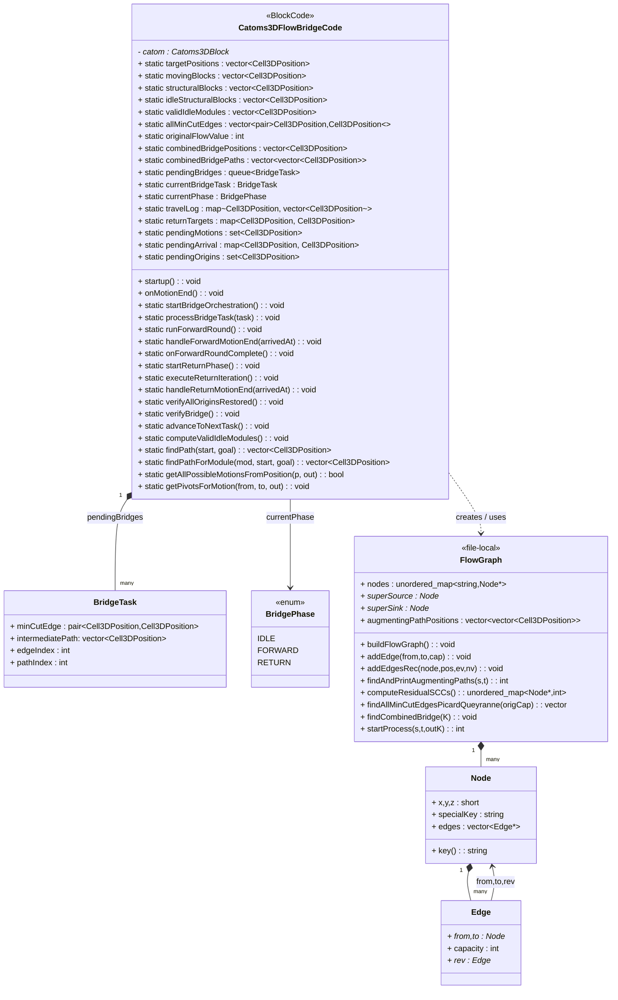
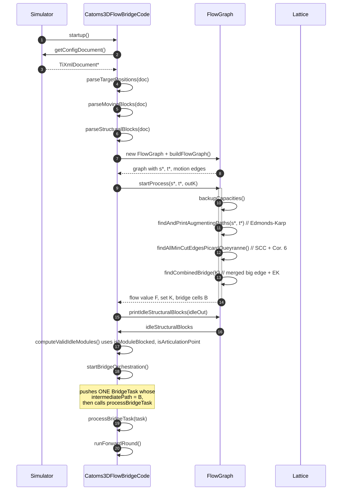
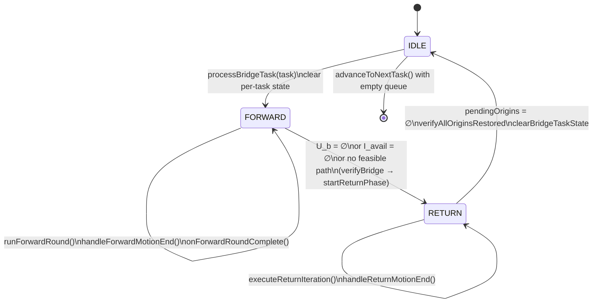

# Catoms3D Flow Bridge - Combined Min-Cut Edge (Combined Test)

## Technical / Software-Engineering Documentation

> Application: `Catoms_3D_Flow_Bridge_Combined_Min_Cut_Edge_Combined_Test`
> Source tree: `applicationsSrc/Catoms_3D_Flow_Bridge_Combined_Min_Cut_Edge_Combined_Test/`

This document complements `SCIENTIFIC.md` and focuses on the
software-engineering structure: classes, types, control flow,
sequence diagrams, state machines, data flow, deployment, and the
mapping from algorithm phases to code symbols.

---

## Table of Contents

1. [Source-Tree Layout](#1-source-tree-layout)
2. [Component Diagram](#2-component-diagram)
3. [Class Diagram](#3-class-diagram)
4. [Object-Level Static Data Diagram](#4-object-level-static-data-diagram)
5. [Sequence Diagram - Startup Pipeline](#5-sequence-diagram--startup-pipeline)
6. [Sequence Diagram - Forward Dispatch (One-at-a-time)](#6-sequence-diagram--forward-dispatch-one-at-a-time)
7. [Sequence Diagram - Return Phase](#7-sequence-diagram--return-phase)
8. [State Machine - `BridgePhase`](#8-state-machine--bridgephase)
9. [Activity Diagram - `runForwardRound`](#9-activity-diagram--runforwardround)
10. [Data-Flow Diagram - Analysis Pipeline](#10-data-flow-diagram--analysis-pipeline)
11. [Deployment Diagram](#11-deployment-diagram)
12. [Phase ↔ Symbol Map](#12-phase--symbol-map)
13. [Build & Run](#13-build--run)
14. [Extension Points](#14-extension-points)

---

## 1. Source-Tree Layout

```
applicationsSrc/Catoms_3D_Flow_Bridge_Combined_Min_Cut_Edge_Combined_Test/
├── Catoms3DFlowBridge.cpp        Entry point  (createSimulator → BlockCode factory)
├── Catoms3DFlowBridgeCode.h      Public class + structs + static state
├── Catoms3DFlowBridgeCode.cpp    FlowGraph (file-local) + full pipeline + orchestration
└── Makefile                      Build rules; produces  Catoms3DFlowBridge
```

External dependencies:

- `simulatorCore/lib/libsimCatoms3D.a`  (VisibleSim Catoms3D runtime)
- `simulatorCore/src/robots/catoms3D/...`  (block code, motion engine, rotation events)
- `simulatorCore/src/base/...`  (simulator, lattice, world, scheduler)

---

## 2. Component Diagram

```mermaid
flowchart LR
    subgraph App["Application binary"]
        MAIN[Catoms3DFlowBridge.cpp\nmain()]
        CODE[Catoms3DFlowBridgeCode\nstatic pipeline + per-module hooks]
        FG[(FlowGraph - file-local)]
    end

    subgraph Sim["VisibleSim Catoms3D runtime"]
        SIM[Simulator]
        LAT[Lattice / World]
        SCHED[Scheduler]
        MOTENG[Catoms3DMotionEngine]
        RULES[Catoms3DMotionRules]
        EVT[Catoms3DRotationStartEvent]
    end

    XML[(config.xml)]

    MAIN --> SIM
    SIM --> CODE
    XML --> CODE
    CODE --> FG
    CODE --> LAT
    CODE --> SCHED
    CODE --> MOTENG
    CODE --> RULES
    SCHED --> EVT
    EVT -. onMotionEnd .-> CODE
```

Key dependencies:

- `Catoms3DFlowBridgeCode` consumes `Simulator::getConfigDocument()`
  for XML parsing.
- It instantiates `FlowGraph` objects (file-local) for analysis and
  bridge construction.
- It queries the live `Lattice` to test cell occupancy and to look
  up the `Catoms3DBlock*` of donor modules.
- It enqueues `Catoms3DRotationStartEvent` events into the
  `Scheduler`; the scheduler invokes
  `Catoms3DFlowBridgeCode::onMotionEnd` after each rotation.

---

## 3. Class Diagram



ASCII fallback (for plain-text viewers):

```
+---------------------------------+         +-----------------+
|  Catoms3DFlowBridgeCode         |<>------>|  BridgeTask     |
|  (BlockCode subclass)           |  queue  |                 |
|                                 |         | minCutEdge      |
|  targetPositions                |         | intermediatePath|
|  movingBlocks                   |         | edgeIndex       |
|  structuralBlocks               |         | pathIndex       |
|  validIdleModules               |         +-----------------+
|  allMinCutEdges                 |
|  combinedBridgePositions        |
|  combinedBridgePaths            |              +-------------+
|  pendingBridges, currentPhase   |--- enum --->|  BridgePhase|
|                                 |              | IDLE        |
|  startup()                      |              | FORWARD     |
|  onMotionEnd()                  |              | RETURN      |
|  runForwardRound()              |              +-------------+
|  executeReturnIteration()       |
|  ...                            |
+----------------+----------------+
                 |
                 v  (creates)
        +-----------------+         +--------+         +--------+
        |   FlowGraph     |<>------>| Node   |<>------>| Edge   |
        | (file-local)    | many    +--------+ many    +--------+
        +-----------------+
```

---

## 4. Object-Level Static Data Diagram

Static members and their roles in the pipeline:

```
                 Phase 1               Phase 3-4             Phase 5            Phases 7-8
                   │                       │                    │                    │
       ┌───────────┴──────┐    ┌───────────┴───────┐  ┌─────────┴────────┐  ┌────────┴──────────┐
       v                  v    v                   v  v                  v  v                   v
  targetPositions    movingBlocks       allMinCutEdges        combinedBridgePositions    pendingBridges
  structuralBlocks   originalFlowValue                       combinedBridgePaths        currentBridgeTask
                                                                                         currentPhase
                                                                                         travelLog
                                                                                         returnTargets
                                                                                         pendingMotions
                                                                                         pendingArrival
                                                                                         pendingOrigins
                                                                                         activeReturn*
       │                   │                   │                    │                          │
       │                   │                   │                    │                          │
   parsed once         set by EK       set by P-Q phase    set by findCombinedBridge   per-task working state
```

---

## 5. Sequence Diagram - Startup Pipeline



---

## 6. Sequence Diagram - Forward Dispatch (One-at-a-time)

```mermaid
sequenceDiagram
    autonumber
    participant Code  as Catoms3DFlowBridgeCode
    participant Lat   as Lattice
    participant Mod   as Catoms3DBlock (donor)
    participant Sched as Scheduler

    loop until U_b = ∅ or I_avail = ∅ or no feasible path
        Code ->> Lat:  enumerate empty bridge cells (U_b)
        Code ->> Lat:  enumerate donors at origin (I_avail)
        loop o ∈ I_avail × b ∈ U_b
            Code ->> Lat: lattice.getBlock(o) → mod
            Code ->> Code: findPathForModule(mod, o, b)
        end
        Code ->> Code: pick shortest path π* (o*, b*)
        alt no path found
            Code ->> Code: verifyBridge(); startReturnPhase()
        else
            Code ->> Mod:   mod = lattice.getBlock(o*)
            Code ->> Sched: schedule Catoms3DRotationStartEvent(now, mod, π*[1])
            Sched -->> Code: onMotionEnd() → handleForwardMotionEnd(arrivedAt)
            loop module advances along π*
                Code ->> Code: handleForwardMotionEnd(arrivedAt)
                alt arrivedAt = b* (destination)
                    Code ->> Code: pendingMotions.erase(o*) → empty
                    Code ->> Code: onForwardRoundComplete()
                else module can advance another step
                    Code ->> Lat: getFreeNeighborCells + canMoveTo
                    Code ->> Sched: schedule next rotation
                else module is stuck
                    Code ->> Code: mark stuck, leave in returnTargets
                    Code ->> Code: onForwardRoundComplete()
                end
            end
            Code ->> Code: onForwardRoundComplete()
            Code ->> Code: runForwardRound()  // next single dispatch
        end
    end
```

---

## 7. Sequence Diagram - Return Phase

```mermaid
sequenceDiagram
    autonumber
    participant Code  as Catoms3DFlowBridgeCode
    participant Lat   as Lattice
    participant Mod   as Catoms3DBlock (stuck donor)
    participant Sched as Scheduler

    Code ->> Code: startReturnPhase()
    Note over Code: filter returnTargets:<br/>drop modules already on bridge cells
    Code ->> Code: pendingOrigins ← origins of remaining
    Code ->> Code: executeReturnIteration()

    loop while pendingOrigins ≠ ∅
        loop module in returnTargets
            Code ->> Code: findPathForModule(mod, curPos, origin)
        end
        Code ->> Code: pick shortest π_r* (curPos*, origin*)
        alt no path
            Code ->> Code: drop module, continue
        else
            Code ->> Sched: schedule first rotation step
            Sched -->> Code: onMotionEnd() → handleReturnMotionEnd
            loop step
                alt arrived at origin
                    Code ->> Code: pendingOrigins.erase(origin*)
                    Code ->> Code: executeReturnIteration()  // next module
                else step infeasible
                    Code ->> Code: recompute path; retry
                else more steps
                    Code ->> Sched: schedule next rotation
                end
            end
        end
    end

    Code ->> Code: verifyAllOriginsRestored()
    Code ->> Code: clearBridgeTaskState()
    Code ->> Code: advanceToNextTask()  // queue empty → halt
```

---

## 8. State Machine - `BridgePhase`



ASCII version:

```
     start
       │
       ▼
   ┌───────┐  processBridgeTask   ┌──────────┐  exit cond   ┌──────────┐  origins ok  ┌───────┐
   │ IDLE  │ ───────────────────► │ FORWARD  │ ───────────► │  RETURN  │ ───────────► │ IDLE  │ ──► halt
   └───────┘                      └────┬─────┘              └────┬─────┘              └───────┘
                                       │ loop                    │ loop
                                       ▼                          ▼
                              one module / round         one module / iter
```

---

## 9. Activity Diagram - `runForwardRound`

```mermaid
flowchart TD
    A([runForwardRound entry]) --> B[collect U_b ← empty cells in intermediatePath]
    B --> C{U_b = ∅ ?}
    C -- yes --> D[verifyBridge → startReturnPhase] --> Z([return])
    C -- no  --> E[collect I_avail ← donors still at origin]
    E --> F{I_avail = ∅ ?}
    F -- yes --> D
    F -- no  --> G[for o,b: π = findPathForModule]
    G --> H{shortest π* found ?}
    H -- no  --> D
    H -- yes --> I[clear pendingMotions / pendingArrival]
    I --> J{lattice has module at o*\nAND mod.canMoveTo π*[1] ?}
    J -- no  --> D
    J -- yes --> K[record travelLog, returnTargets,\npendingMotions, pendingArrival]
    K --> L[schedule Catoms3DRotationStartEvent\n(now, mod, π*[1])]
    L --> M([wait for onMotionEnd])
    M -. handleForwardMotionEnd .-> N[step the module]
    N --> O{arrivedAt = destination ?}
    O -- yes --> P[onForwardRoundComplete]
    O -- no  --> Q{can advance to next step ?}
    Q -- yes --> L
    Q -- no  --> R[mark stuck → record in returnTargets]
    R --> P
    P --> A
```

ASCII version:

```
runForwardRound
       │
       ▼
collect U_b (empty bridge cells)
       │
   ┌───┴─────────┐
 U_b empty?     │ no
   │ yes        ▼
verifyBridge  collect I_avail (donors at origin)
+startReturn       │
   │           ┌───┴────────────┐
   exit       I_avail empty?    │ no
              yes ──► same exit  ▼
                              foreach (o,b): π = findPathForModule
                                            keep shortest π*
                                  │
                              ┌───┴──────────┐
                            π* found?       │ no
                            yes             ▼
                              │       same exit
                              ▼
                       dispatch first step of π*
                              │
                              ▼
                     handleForwardMotionEnd loop
                     (step-by-step rotations)
                              │
                       ┌──────┴───────┐
                  arrived              stuck
                       │                  │
                       └──────┬───────────┘
                              ▼
                    onForwardRoundComplete
                              │
                              ▼
                      runForwardRound (recurse)
```

---

## 10. Data-Flow Diagram - Analysis Pipeline

```
   ┌───────────────┐
   │  config.xml   │
   └──────┬────────┘
          │
          ▼
   parse{Target,Moving,Structural}Positions  ── Phase 1
          │
          ▼  M, T, S
   FlowGraph::buildFlowGraph                  ── Phase 2
          │
          ▼  G* = (V*, A*, c)
   FlowGraph::backupCapacities                ── snapshot c
   FlowGraph::findAndPrintAugmentingPaths     ── Phase 3 (Edmonds-Karp)
          │
          ▼  f*, residual G_r
   FlowGraph::findAllMinCutEdgesPicardQueyranne
          ├─► computeResidualSCCs (Tarjan)    ── Phase 4
          └─► saturated arcs with SCC(u)≠SCC(v)
          │
          ▼  K = ⋃ all min-cut arcs
   FlowGraph::findCombinedBridge              ── Phase 5
          │
          ▼  combinedBridgePositions B, combinedBridgePaths
   printIdleStructuralBlocks                  ── Phase 6 (raw idle pool)
   computeValidIdleModules                    ── Phase 6 (filtered I)
          │
          ▼
   startBridgeOrchestration → processBridgeTask
          │
          ▼  state machine in BridgePhase
   runForwardRound  ⇄  handleForwardMotionEnd   ── Phase 7
   executeReturnIteration ⇄ handleReturnMotionEnd  ── Phase 8
          │
          ▼
   verifyBridge   (rebuild G*, re-run EK → confirm |f| grew)
```

---

## 11. Deployment Diagram

```mermaid
flowchart TB
    subgraph Host[Host machine]
        subgraph Build[Build artefacts]
            BIN[Catoms3DFlowBridge\n(executable)]
            STATIC[libsimCatoms3D.a]
        end
        subgraph Runtime[Runtime]
            XMLF[config.xml]
            GUI[OpenGL / GLUT GUI]
        end
    end

    BIN -- links --> STATIC
    BIN -- reads --> XMLF
    BIN -- renders --> GUI
```

---

## 12. Phase ↔ Symbol Map

| Phase | Operation | Symbol(s) in code |
|---|---|---|
| 1 | XML parsing | `parseTargetPositions`, `parseMovingBlocks`, `parseStructuralBlocks` |
| 2 | Flow graph build | `FlowGraph::buildFlowGraph`, `addEdge`, `addEdgesRec`, `getAllPossibleMotionsFromPosition` |
| 3 | Edmonds-Karp | `FlowGraph::findAndPrintAugmentingPaths`, `backupCapacities` |
| 4 | Picard–Queyranne | `FlowGraph::computeResidualSCCs`, `FlowGraph::findAllMinCutEdgesPicardQueyranne` |
| 5 | Combined bridge | `FlowGraph::findCombinedBridge`, `combinedBridgePositions`, `combinedBridgePaths` |
| 6 | Idle filtering | `printIdleStructuralBlocks`, `isModuleBlocked`, `isArticulationPoint`, `computeValidIdleModules` |
| 7 | Forward dispatch | `startBridgeOrchestration`, `processBridgeTask`, `runForwardRound`, `handleForwardMotionEnd`, `onForwardRoundComplete` |
| 8 | Return | `startReturnPhase`, `executeReturnIteration`, `handleReturnMotionEnd`, `verifyAllOriginsRestored` |
| ✔ | Verification | `verifyBridge` (re-run Edmonds-Karp on the modified lattice) |
| ⟲ | State reset / advance | `clearBridgeTaskState`, `advanceToNextTask` |

---

## 13. Build & Run

```sh
# From the repository root
cd applicationsSrc/Catoms_3D_Flow_Bridge_Combined_Min_Cut_Edge_Combined_Test
make
../../applicationsBin/Catoms_3D_Flow_Bridge_Combined_Min_Cut_Edge_Combined_Test/Catoms3DFlowBridge \
    -f path/to/config.xml
```

Compiler used: `g++ -std=c++17 -Wall -Wsuggest-override -fno-stack-protector`
linked against `libsimCatoms3D.a`.

---

## 14. Extension Points

| Hook | Where | Purpose |
|---|---|---|
| Bridge selection strategy | `runForwardRound` - replace "shortest path" rule with another priority (e.g. risk-aware) | Change which (donor, bridge cell) pair to dispatch first. |
| Min-cut classification | `findAllMinCutEdgesPicardQueyranne` | Filter or weight specific min-cut arcs (e.g. by spatial layer). |
| Combined-bridge geometry | `findCombinedBridge` | Replace the head/tail merging policy (e.g. include `U ∩ V_h` as additional intermediates). |
| Verification metric | `verifyBridge` | Compare other graph invariants beyond `|f|`. |
| Motion handlers | `handleForwardMotionEnd` / `handleReturnMotionEnd` | Plug in alternative re-routing heuristics. |

Each extension can be made without changing the public class
contract (`Catoms3DFlowBridgeCode::startup` and
`Catoms3DFlowBridgeCode::onMotionEnd`).
