# Catoms3D Flow Bridge - Final Variant

## Technical / Software-Engineering Documentation

> **Application**: `flowBridgeFinal`
> **Source tree**: `applicationsSrc/flowBridgeFinal/`
> **Binary**: `applicationsBin/flowBridgeFinal/Catoms3DFlowBridge`
> **Configuration tested**: `applicationsBin/flowBridge/island_config.xml`

This document is the engineering reference for `flowBridgeFinal`. It is
the companion of `SCIENTIFIC.md`, which presents the algorithmic
foundation. Here we describe the source layout, types, classes, static
data, control flow, diagrams, deployment, the line-level mapping of
algorithmic phases to code symbols, and concrete worked examples
demonstrating the runtime behaviour.

The "Final" variant is the immediate successor of
`Catoms_3D_Flow_Bridge_Combined_Min_Cut_Edge_Combined_Test`. It keeps
the full combined-min-cut-edge pipeline and the donor-selection state
machine, and **introduces one new pipeline phase**:
`verifyBridgeVirtually()` - a pre-orchestration prediction step that
inserts phantom modules at every bridge cell, virtually relocates the
moving blocks that will fill them, rebuilds the flow graph from
scratch, and re-runs Edmonds–Karp to predict the post-bridge flow
**before** any physical motion is dispatched.

---

## Table of Contents

1. [Source-Tree Layout and Build Wiring](#1-source-tree-layout-and-build-wiring)
2. [Glossary of Identifiers](#2-glossary-of-identifiers)
3. [Component Diagram](#3-component-diagram)
4. [Class Diagram](#4-class-diagram)
5. [Static State Inventory](#5-static-state-inventory)
6. [Internal `FlowGraph` Anatomy](#6-internal-flowgraph-anatomy)
7. [Lattice / Motion-Engine Touchpoints](#7-lattice--motion-engine-touchpoints)
8. [Startup Pipeline (Sequence Diagram)](#8-startup-pipeline-sequence-diagram)
9. [`verifyBridgeVirtually` (Sequence Diagram)](#9-verifybridgevirtually-sequence-diagram)
10. [Forward Dispatch (Sequence Diagram)](#10-forward-dispatch-sequence-diagram)
11. [Return Phase (Sequence Diagram)](#11-return-phase-sequence-diagram)
12. [State Machine - `BridgePhase`](#12-state-machine--bridgephase)
13. [State Machine - `SelectionStage`](#13-state-machine--selectionstage)
14. [Activity Diagram - `runForwardRound`](#14-activity-diagram--runforwardround)
15. [Data-Flow Diagram - Full Pipeline](#15-data-flow-diagram--full-pipeline)
16. [Deployment Diagram and CLI](#16-deployment-diagram-and-cli)
17. [Phase ↔ Symbol Map](#17-phase--symbol-map)
18. [Phantom-Module Engineering](#18-phantom-module-engineering)
19. [Concrete Walkthrough on `island_config.xml`](#19-concrete-walkthrough-on-island_configxml)
20. [Diagnostic Output Cheat Sheet](#20-diagnostic-output-cheat-sheet)
21. [Build, Run, and XML Schema](#21-build-run-and-xml-schema)
22. [Extension Points and Variation Recipes](#22-extension-points-and-variation-recipes)
23. [Frequently Asked Questions](#23-frequently-asked-questions)

---

## 1. Source-Tree Layout and Build Wiring

### 1.1 Files

```
applicationsSrc/flowBridgeFinal/
├── Catoms3DFlowBridge.cpp        ~19 lines    main() entry; spins up Simulator
├── Catoms3DFlowBridgeCode.h      ~365 lines   public class + BridgeTask + enums + static decls
├── Catoms3DFlowBridgeCode.cpp   ~2335 lines   FlowGraph + pipeline + orchestration + virtual verifier
└── Makefile                        ~90 lines   POSIX rules (CMake is the canonical build)
```

### 1.2 CMake registration

The top-level `CMakeLists.txt` carries the explicit registration:

```cmake
add_executable(flowBridgeFinal
    applicationsSrc/flowBridgeFinal/Catoms3DFlowBridge.cpp
    applicationsSrc/flowBridgeFinal/Catoms3DFlowBridgeCode.cpp)
target_link_libraries(flowBridgeFinal Catoms3D -lfreeglut -lmuparser -lOpenGL32 -lglu32 -lglew32)
install(TARGETS flowBridgeFinal RUNTIME DESTINATION applicationsBin/flowBridgeFinal)
```

The libraries reflect the Windows / MinGW build (`-lOpenGL32 -lglu32
-lglew32`); on Linux the link list is `-lGL -lGLU -lGLEW` per the
top-level CMake conditional.

### 1.3 External dependencies

| Layer | Symbols used | Files |
|---|---|---|
| Simulator core | `Simulator`, `Scheduler`, `BuildingBlock`, `BlockCode`, `World` | `simulatorCore/src/base/*` |
| Lattice | `Lattice`, `FCCLattice`, `Cell3DPosition` | `simulatorCore/src/grid/lattice.{h,cpp}`, `simulatorCore/src/math/cell3DPosition.h` |
| Catoms3D runtime | `Catoms3DBlock`, `Catoms3DBlockCode`, `Catoms3DGlBlock`, `Catoms3DWorld`, `Catoms3DMotionEngine`, `Catoms3DMotionRules`, `Catoms3DRotationStartEvent` | `simulatorCore/src/robots/catoms3D/*` |
| XML | `TiXmlDocument`, `TiXmlElement` | `simulatorCore/src/utils/tinyxml/*` |
| Math | `Matrix`, `Vector3D` | `simulatorCore/src/math/*` |

### 1.4 Single-translation-unit invariants

`FlowGraph`, `Node`, and `Edge` are declared at file scope inside
`Catoms3DFlowBridgeCode.cpp`. They are **not** exposed in the header
because (a) they have no API surface for callers, and (b) keeping them
file-local lets the implementation evolve their internals without
forcing recompilation of any other translation unit.

The diagnostic block inside `verifyBridgeVirtually()` references
`FlowGraph::nodes`, `Node::edges`, and `Edge::capacity` / `Edge::to`
directly - this is intentional and only safe because all five symbols
live in the same translation unit.

---

## 2. Glossary of Identifiers

| Identifier | Type | Meaning |
|---|---|---|
| `M` | conceptual | the set `movingBlocks` |
| `T` | conceptual | the set `targetPositions` |
| `S` | conceptual | the set `structuralBlocks` |
| `B` | conceptual | the set `combinedBridgePositions` |
| `O` | conceptual | the set of currently occupied lattice cells |
| `s_star` | conceptual | the super-source node |
| `t_star` | conceptual | the super-sink node |
| `F` | int | `originalFlowValue`, the pre-bridge max-flow |
| `F_virtual` | int | the flow returned by `verifyBridgeVirtually` |
| `newFlow` | int | the flow returned by post-bridge `verifyBridge` |
| `phantom` | object | a synthetic `Catoms3DBlock` inserted only during the virtual verifier |
| `donor` | object | the moving / idle module chosen to fill one bridge cell in one round |

Across both documents, the pseudo-variables `s_star` and `t_star` are
used for the super-source / super-sink in code-formatted contexts to
avoid any risk of Markdown italic-asterisk interpretation. In prose
they are referred to as "super-source" and "super-sink".

---

## 3. Component Diagram

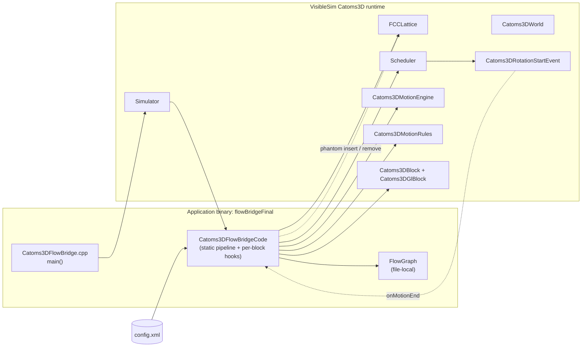

### 3.1 Edge semantics

| From | To | Meaning |
|---|---|---|
| `MAIN -> SIM` | function call | `createSimulator(argc, argv, buildNewBlockCode)` registers the BlockCode factory. |
| `SIM -> CODE` | callback | The simulator invokes `Catoms3DFlowBridgeCode::startup` on the first block instance. |
| `XML -> CODE` | data read | `Simulator::getConfigDocument()` returns the parsed `TiXmlDocument`; `parseTargetPositions/Moving/Structural` walk it. |
| `CODE -> FG` | construct/destruct | The code instantiates two flavours of `FlowGraph`: the main one and an internal sub-flow-graph used inside `findCombinedBridge`. |
| `CODE -> LAT` | query | `lattice->getBlock`, `getFreeNeighborCells`, `getActiveNeighborCells`, `getNeighborhood`, `isInGrid`, `isFree`. |
| `CODE -> SCHED` | enqueue | `scheduler->schedule(new Catoms3DRotationStartEvent(...))` triggers a rotation event. |
| `CODE -> MOTENG` | call | `findPivotLinkPairsForTargetCell`, `findMotionPivot`, `canMoveTo`. |
| `CODE -> RULES` | call | `getValidMotionListFromPivot` enumerates valid pivot-driven motions. |
| `CODE -> BLOCK` | construct/destruct | The verifier instantiates phantom `Catoms3DBlock` + `Catoms3DGlBlock` objects, never registering them with the world. |
| `SCHED -> EVT` | dispatch | Pending rotation events fire in time order. |
| `EVT -. onMotionEnd .-> CODE` | callback | After each rotation, the affected block's `onMotionEnd` runs. |
| `CODE -. phantom insert/remove .-> LAT` | mutate | The virtual verifier transiently inserts and removes phantoms via `lattice->insert/remove`. |

---

## 4. Class Diagram

To avoid nested-generic rendering issues, type parameters are written
with placeholder names (`Cells`, `EdgeList`, `BridgeMap`, ...) and a
short legend immediately below the diagram.

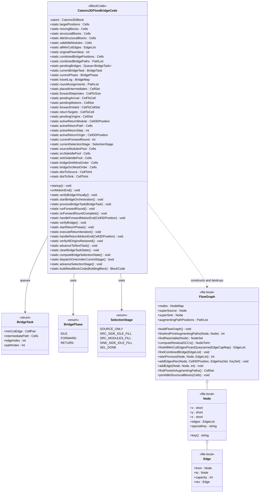

### 4.1 Type-parameter legend

| Placeholder name | Real C++ type |
|---|---|
| `Cells` | `std::vector<Cell3DPosition>` |
| `CellSet` | `std::set<Cell3DPosition>` |
| `CellPair` | `std::pair<Cell3DPosition, Cell3DPosition>` |
| `EdgeList` | `std::vector<std::pair<Cell3DPosition, Cell3DPosition>>` |
| `PathList` | `std::vector<std::vector<Cell3DPosition>>` |
| `BridgeMap` | `std::map<Cell3DPosition, std::vector<Cell3DPosition>>` |
| `CellToCell` | `std::map<Cell3DPosition, Cell3DPosition>` |
| `CellToSize` | `std::map<Cell3DPosition, size_t>` |
| `CellToInt` | `std::map<Cell3DPosition, int>` |
| `CellToCellSet` | `std::map<Cell3DPosition, std::set<Cell3DPosition>>` |
| `NodeMap` | `std::unordered_map<std::string, Node*>` |
| `NodeSet` | `std::set<Node*>` |
| `NodeToInt` | `std::unordered_map<Node*, int>` |
| `EdgeCapMap` | `std::unordered_map<Edge*, int>` |
| `EdgeKeySet` | `std::set<std::pair<std::string, std::string>>` |
| `KeySet` | `std::set<std::string>` |

### 4.2 Why the algorithmic state is static

`Catoms3DFlowBridgeCode` derives from `Catoms3DBlockCode`. Every catom
in the simulation gets its own `Catoms3DFlowBridgeCode` instance, but
**all algorithmic state is `static`**. The first call to `startup()`
(guarded by a function-local `static bool hasRun = false;`) runs the
entire analysis pipeline; subsequent block-startup events are no-ops.
The non-static surface is exactly:

```cpp
Catoms3DBlock *catom;                          // owning block pointer
Catoms3DFlowBridgeCode(Catoms3DBlock *host);   // constructor
void startup() override;                       // one-shot pipeline
void onMotionEnd() override;                   // per-block motion callback
```

`onMotionEnd` is the only instance method that the simulator invokes
post-startup; it forwards to the static handler appropriate for the
current `BridgePhase`.

---

## 5. Static State Inventory

The static fields fall into five logical groups. Line references point
into `Catoms3DFlowBridgeCode.cpp` unless noted otherwise.

### 5.1 Configuration (parsed from XML)

| Field | Populated by | Used by |
|---|---|---|
| `targetPositions` | `parseTargetPositions` (`~L1113`) | `FlowGraph::buildFlowGraph`, donor-state setup |
| `movingBlocks` | `parseMovingBlocks` (`~L1129`) | `FlowGraph::buildFlowGraph`, virtual verifier, donor pool |
| `structuralBlocks` | `parseStructuralBlocks` (`~L1143`) | `isArticulationPoint`, neighborhood queries |
| `idleStructuralBlocks` | `FlowGraph::printIdleStructuralBlocks` | `computeValidIdleModules` |
| `validIdleModules` | `computeValidIdleModules` (`~L1078`) | donor pool partitioning |

### 5.2 Flow / cut analysis

| Field | Populated by | Used by |
|---|---|---|
| `allMinCutEdges` | `FlowGraph::startProcess` → `findAllMinCutEdgesPicardQueyranne` | `findCombinedBridge`, `verifyBridge` diagnostic |
| `originalFlowValue` | `FlowGraph::startProcess` return value | `verifyBridge`, `verifyBridgeVirtually` |
| `combinedBridgePositions` | `findCombinedBridge` | `verifyBridgeVirtually`, `startBridgeOrchestration` |
| `combinedBridgePaths` | `findCombinedBridge` | diagnostic only |

### 5.3 Orchestration core

| Field | Reset where | Mutated where |
|---|---|---|
| `pendingBridges` | `startBridgeOrchestration` | `startBridgeOrchestration`, `advanceToNextTask` |
| `currentBridgeTask` | `processBridgeTask` | `processBridgeTask` |
| `currentPhase` | `processBridgeTask`, `clearBridgeTaskState` | every transition |
| `travelLog` | `processBridgeTask`, `clearBridgeTaskState` | `dispatchOneUnderCurrentStage`, `handleForwardMotionEnd` |
| `roundAssignments` | `processBridgeTask`, `clearBridgeTaskState` | `dispatchOneUnderCurrentStage` |
| `placedIntermediates` | `processBridgeTask`, `clearBridgeTaskState` | `onForwardRoundComplete` |
| `forwardStepIndex` | `processBridgeTask`, `clearBridgeTaskState` | `dispatchOneUnderCurrentStage`, `handleForwardMotionEnd` |
| `pendingArrival` | `processBridgeTask`, `clearBridgeTaskState` | `dispatchOneUnderCurrentStage`, `handleForwardMotionEnd` |
| `pendingMotions` | `processBridgeTask`, `clearBridgeTaskState` | `dispatchOneUnderCurrentStage`, `handleForwardMotionEnd` |
| `forwardVisited` | `processBridgeTask`, `clearBridgeTaskState` | `handleForwardMotionEnd` |

### 5.4 Return-phase state

| Field | Reset where | Mutated where |
|---|---|---|
| `returnTargets` | `processBridgeTask`, `startReturnPhase`, `clearBridgeTaskState` | `dispatchOneUnderCurrentStage`, `handleForwardMotionEnd`, `handleReturnMotionEnd` |
| `pendingOrigins` | `startReturnPhase`, `clearBridgeTaskState` | `handleReturnMotionEnd`, `executeReturnIteration` |
| `activeReturnModule` | `clearBridgeTaskState` | `executeReturnIteration`, `handleReturnMotionEnd` |
| `activeReturnPath` | `clearBridgeTaskState` | `executeReturnIteration`, `handleReturnMotionEnd` (reroute) |
| `activeReturnStep` | `processBridgeTask`, `clearBridgeTaskState` | `executeReturnIteration`, `handleReturnMotionEnd` |
| `activeReturnOrigin` | `clearBridgeTaskState` | `executeReturnIteration` |

### 5.5 Donor-selection state

| Field | Populated by | Cleared by |
|---|---|---|
| `currentSelectionStage` | `computeBridgeSelectionState`, `advanceSelectionStage` | `clearBridgeTaskState` |
| `sourceModulesPool` | snapshot of `movingBlocks` | `clearBridgeTaskState` |
| `srcSideIdlePool`, `sinkSideIdlePool` | partition of `validIdleModules` by `distToSource <= distToSink` | `clearBridgeTaskState` |
| `bridgeSinkMostOrder`, `bridgeSrcMostOrder` | sort of `combinedBridgePositions` by BFS distance | `clearBridgeTaskState` |
| `distToSource`, `distToSink` | multi-source BFS from `movingBlocks` / `targetPositions` | `clearBridgeTaskState` |

---

## 6. Internal `FlowGraph` Anatomy

`FlowGraph` is declared at file scope (`Catoms3DFlowBridgeCode.cpp`,
roughly L48–L611). It is a self-contained, owning, directed graph
optimised for unit-capacity flow analysis. The whole structure is
discarded at the end of the analysis phase; the only state that lives
beyond it is the populated static fields of `Catoms3DFlowBridgeCode`.

### 6.1 Node, Edge

```cpp
struct Node {
    short x, y, z;
    vector<Edge*> edges;
    string specialKey;
    string key() const;          // "x,y,z" or specialKey if non-empty
};

struct Edge {
    Node *from, *to;
    int   capacity;
    Edge *rev;                   // reverse edge for residual graph
};
```

Salient details:

- `key()` returns either the cell triplet `"x,y,z"` (for lattice cells)
  or `specialKey` (for `SUPER_SOURCE` / `SUPER_SINK`). `key()` is the
  hash key in `FlowGraph::nodes`.
- Each `addEdge(u, v, cap)` allocates *two* `Edge` objects: the forward
  with capacity `cap` and the reverse with capacity `0`, mutually
  cross-linked via `rev`. This makes residual graph queries trivial.
- The reverse edge always has `originalCap == 0`; the
  Picard–Queyranne path filters on `originalCap > 0` to exclude
  reverses.

### 6.2 Key methods

| Method | Lines | Role |
|---|---|---|
| `getOrCreateNode(short, short, short)` | ~L65 | Hash-cached factory keyed by `"x,y,z"`. |
| `getOrCreateSpecial(string)` | ~L78 | Factory for super-source / super-sink. |
| `addEdge(Node*, Node*, int)` | ~L86 | Builds forward + reverse pair. |
| `addEdgesRec(Node*, Cell3DPosition, EdgeKeySet&, KeySet&)` | ~L94 | DFS expansion through the motion graph using `getAllPossibleMotionsFromPosition`. |
| `buildFlowGraph()` | ~L114 | Wires `s_star → m` for each `m in M`, expands from each, then wires every `t in T` → `t_star`. |
| `backupCapacities()` | ~L135 | Snapshot of every edge's current capacity, used to recognise *original* arcs after Edmonds–Karp has mutated capacities. |
| `findAndPrintAugmentingPaths(Node*, Node*)` | ~L143 | Edmonds–Karp BFS-augmentation loop; records `augmentingPathPositions`. |
| `findReachable(Node*)` | ~L186 | DFS over the residual graph (used by older variants). |
| `computeResidualSCCs()` | ~L254 | Iterative Tarjan over the residual graph. |
| `findAllMinCutEdgesPicardQueyranne(originalCap)` | ~L330 | Filters saturated forward arcs whose endpoints lie in distinct SCCs. |
| `findCombinedBridge(EdgeList)` | ~L399 | Merges all min-cut arcs into one big edge, builds a sub-graph through empty space, runs EK on it, deduplicates intermediates. |
| `findPivotsInAugmentingPaths()` | ~L534 | Returns the set of cells used as rotation pivots in the augmenting paths. |
| `printIdleStructuralBlocks(Cells&)` | ~L542 | Filters `structuralBlocks` against the pivots set; populates `idleStructuralBlocks`. |
| `reportSourceSinkFlows(...)` | ~L570 | Diagnostic: per-source / per-sink flow on the s_star / t_star boundary. |
| `startProcess(...)` | ~L602 | Top-level orchestrator: EK → diagnostic → Picard–Queyranne → combined bridge. |

### 6.3 Tarjan implementation note

`computeResidualSCCs` is intentionally written **iteratively** because
the residual graph on real configurations can reach `|V|` in the
thousands; a naive recursive Tarjan would risk stack overflow under
MinGW's relatively small default stack. Each recursion frame is
modelled as a `Frame { Node* v; size_t ei; }` and pushed onto an
explicit `vector<Frame> callStack`.

### 6.4 Edge filter for Picard–Queyranne

For a forward edge `e` with `originalCap > 0`:

```text
isCutEdge(e) = (e.capacity == 0)                  saturated
              AND (scc(e.from) != scc(e.to))      across SCC boundary
              AND e.from is NOT a special node    excludes the super-source side
              AND e.to   is NOT a special node    excludes the super-sink side
```

`e.capacity == 0` corresponds to `f(e) = originalCap`; if also
`scc(from) != scc(to)`, the edge is in **some** min-cut by
Picard–Queyranne.

---

## 7. Lattice / Motion-Engine Touchpoints

### 7.1 Lattice queries used by the application

| Query | Returned data | Used where |
|---|---|---|
| `getBlock(p)` | the `BuildingBlock*` at `p` or `nullptr` | every motion-engine call, the verifier teardown, the round banner |
| `isInGrid(p)` | `true` iff `p` is inside the world's bounding box | verifier sanity check, `getConnectorId` |
| `isFree(p)` | `true` iff `getBlock(p) == nullptr` *and* `p` is in grid | `getAllPossibleMotionsFromPosition`, BFS expansion |
| `getNeighborhood(p)` | the immediate FCC neighbours of `p` (length 12 minus boundary clips) | distance-BFS in `bfsDistancesFromSet`, neighbour-conflict checks |
| `getFreeNeighborCells(p)` | neighbours of `p` whose cell is empty (plus a few diagonals in the FCC implementation) | `getAllPossibleMotionsFromPosition` occupied branch |
| `getActiveNeighborCells(p)` | neighbours of `p` whose cell is occupied | `getAllPossibleMotionsFromPosition` empty branch |
| `insert(BuildingBlock*, p, count)` | `void` | verifier phantom insertion |
| `remove(p, count)` | `void` | verifier phantom removal and source relocation |

### 7.2 Motion engine details

`Catoms3DFlowBridgeCode::getAllPossibleMotionsFromPosition` is the
gateway used by every BFS-style routine. It has two distinct branches:

```cpp
if (mod = lattice->getBlock(position)) {
    // OCCUPIED branch
    for each nb in lattice->getFreeNeighborCells(position):
        if (mod->canMoveTo(nb)) reachable.push_back(nb);
} else {
    // EMPTY branch
    for each nb in lattice->getActiveNeighborCells(position):
        neigh = lattice->getBlock(nb)                       // a real pivot
        conFrom = neigh->getConnectorId(position)
        motionRules.getValidMotionListFromPivot(neigh, conFrom, vec, lattice, nullptr)
        for each link in vec:
            neigh->getNeighborPos(link.toID, toPos)
            reachable.push_back(toPos)
}
```

Both branches ultimately call into the same motion-rules table
(`Catoms3DMotionRules::tabConnectors`, the same one used by the
real-time rotation events). This is critical for the virtual verifier:
the empty-cell branch is what makes a phantom pivot at a bridge cell
contribute new motion possibilities to the flow graph.

### 7.3 The "opposite-of-FROM must be free" rule

Inside `Catoms3DMotionRules::getValidMotionListFromPivot` (in
`simulatorCore/src/robots/catoms3D/catoms3DMotionRules.cpp` around line
401) sits the rule:

```cpp
pos2 = pos + pos - pivot->position;     // mirror of FROM through pivot
if (lattice->cellHasBlock(pos2)) return false;
```

This rule is **why** the virtual verifier must remove source modules
before inserting phantoms. With a phantom pivot at `(6,2,1)` and a
moving-block at `(4,2,1)`, motion from FROM=`(5,2,1)` to TO=`(6,1,1)`
is rejected because `pos2 = 2*(5,2,1) - (6,2,1) = (4,2,1)` is occupied
by the moving block. After removing it, the phantom is free to act as a
pivot.

---

## 8. Startup Pipeline (Sequence Diagram)

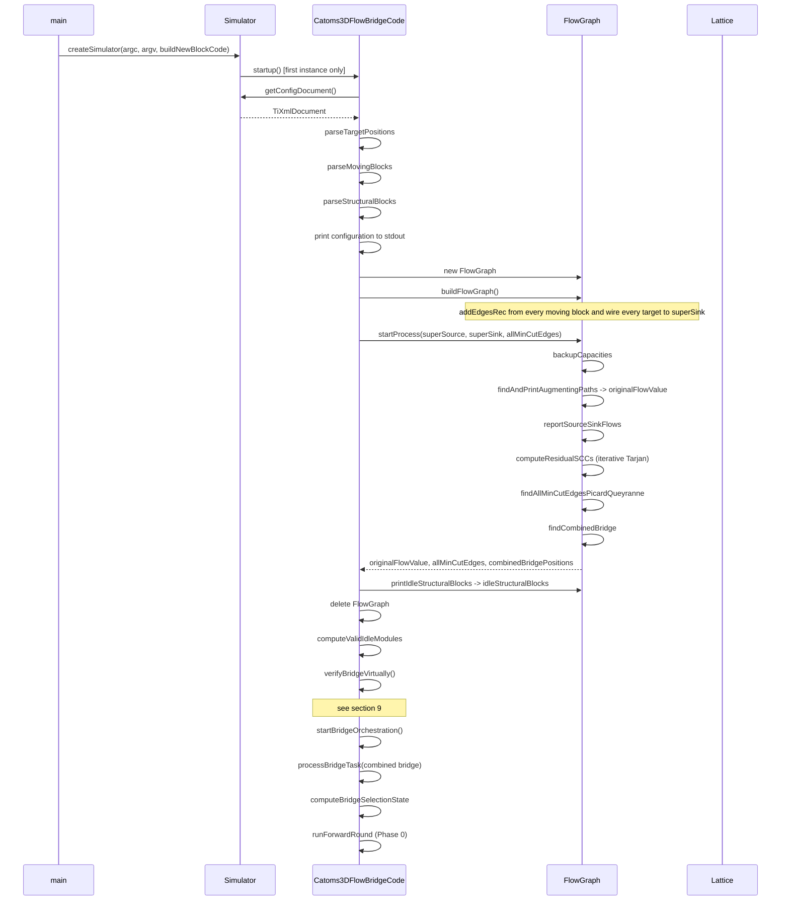

### 8.1 Why the first instance owns the pipeline

`Catoms3DFlowBridgeCode::startup` opens with:

```cpp
static bool hasRun = false;
if (hasRun) return;
hasRun = true;
```

This guard ensures that only the very first block in the simulation's
startup sequence runs the heavy analysis. All other blocks see the
"already-run" branch and return immediately. The choice is incidental
(any block could carry the pipeline) - what matters is exactly-once
execution.

---

## 9. `verifyBridgeVirtually` (Sequence Diagram)

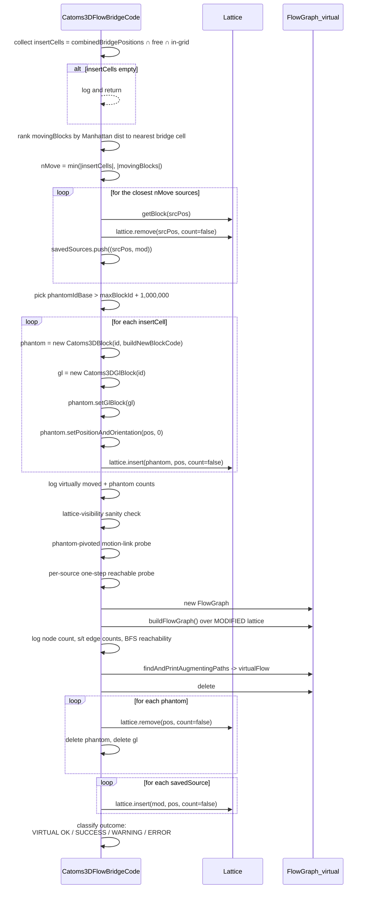

### 9.1 Why phantom insertion alone is not enough

The motion-engine rule documented in §7.3 rejects any phantom-pivoted
motion whose mirror cell is occupied by a source. Removing the closest
`|insertCells|` sources before inserting phantoms restores the
geometric clearance that the actual orchestration would have produced
anyway - and yields a flow graph that is provably isomorphic to the
post-orchestration graph (§7.1 of `SCIENTIFIC.md`).

### 9.2 Exception safety

The phantom-insertion loop has a `try { lattice->insert(...); }
catch (...)`. On exception:

1. The just-created `phantom` and `gl` are deleted.
2. Every previously-inserted phantom is removed from the lattice and
   its `phantom`/`gl` deleted.
3. Every previously-removed source is re-inserted via
   `lattice->insert(mod, pos, count=false)`.

The end-of-function teardown (after Edmonds–Karp completes
successfully) performs the same operations in the same order, with the
phantoms removed first and the sources re-inserted afterwards. The net
effect is that the lattice and `nbModules` are unchanged after the
verifier returns under any code path.

### 9.3 Source-removal heuristic, formally

```text
for each s in movingBlocks:
    d(s) = min over b in insertCells of   s.dist_taxi(b)

stable_sort movingBlocks by d ascending
remove the first  min(|insertCells|, |movingBlocks|)  of them
```

With stable sorting, on the canonical `island_config.xml`:

```
movingBlocks order (XML):   (1,1,1) (1,2,1) (1,3,1) (1,4,1)
                            (2,1,1) (2,2,1) (2,3,1) (2,4,1)
                            (3,1,1) (3,2,1) (3,3,1) (3,4,1)
                            (4,1,1) (4,2,1) (4,3,1) (4,4,1)

d(s) values (Manhattan to nearest of 14 bridge cells):
   x=4: ~ 2          x=3: ~ 3          x=2: ~ 4          x=1: ~ 5..6

removed first (14 of 16):  all of x=4, x=3, x=2  +  (1,1,1) (1,2,1)
retained (2 of 16):        (1,3,1) (1,4,1)
```

That is exactly the same set of 14 sources the donor-selection state
machine consumes during the real orchestration. The match is not a
coincidence: both schemes prefer the geometrically closest donors.

---

## 10. Forward Dispatch (Sequence Diagram)

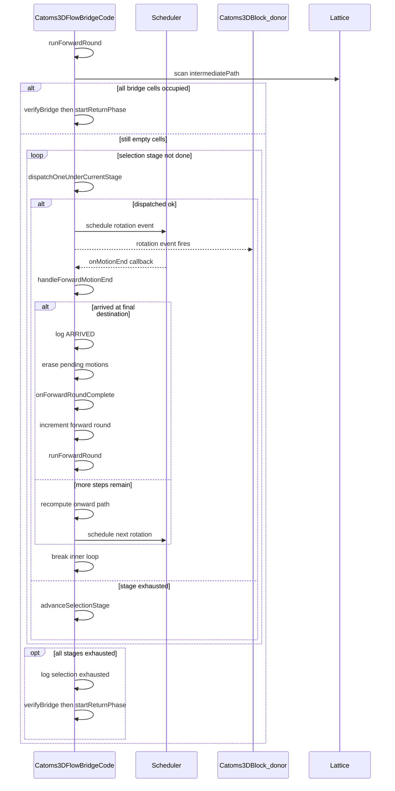

### 10.1 Single-in-flight invariant

The forward loop is strictly serialised: at most **one** module is in
flight at any time. The only way to leave `dispatchOneUnderCurrentStage`
with `true` is to have just scheduled exactly one
`Catoms3DRotationStartEvent`; the next `runForwardRound` is invoked
only from `onForwardRoundComplete`, which is only called when
`pendingMotions` becomes empty.

This invariant guarantees that `forwardVisited`, `forwardStepIndex`,
`pendingArrival` and `travelLog` can each be keyed by a single origin
without worrying about concurrent modifications.

### 10.2 Reroute on stuck

When `handleForwardMotionEnd` discovers that the module can no longer
reach `finalDest` without revisiting an already-visited cell, it:

1. Logs `[Bridge] Module from <origin> stuck at <arrivedAt> ...`.
2. Leaves the module at `arrivedAt`.
3. Updates `returnTargets` so the return phase finds the module.
4. Frees the bridge cell so a future donor can retry.
5. Erases `travelLog`, `forwardStepIndex`, `forwardVisited` for the
   origin, then calls `onForwardRoundComplete` if `pendingMotions` is
   empty.

---

## 11. Return Phase (Sequence Diagram)

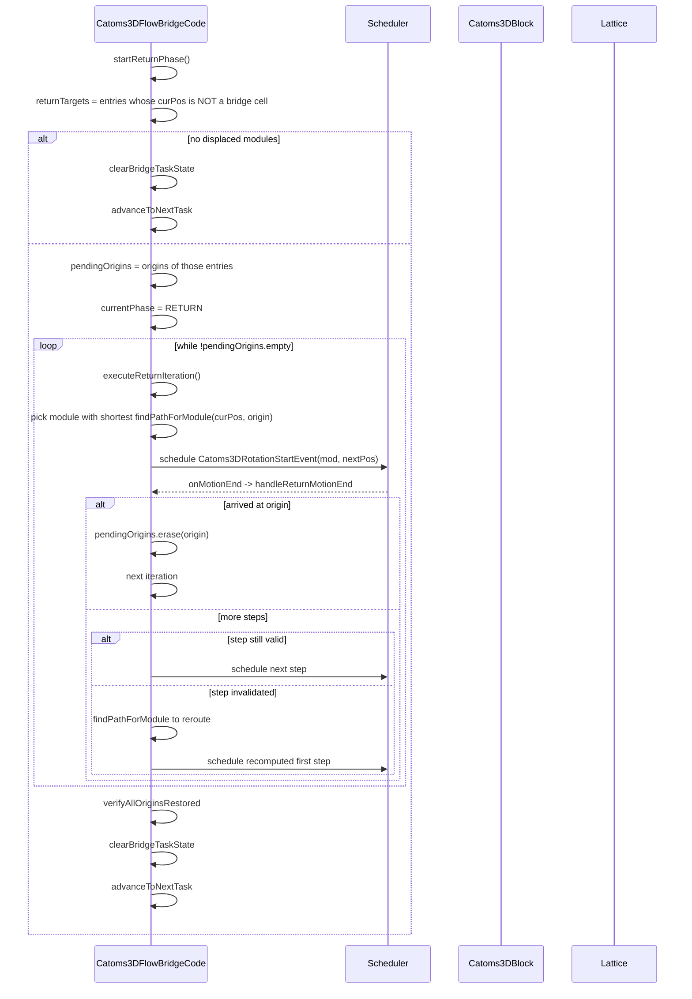

---

## 12. State Machine - `BridgePhase`

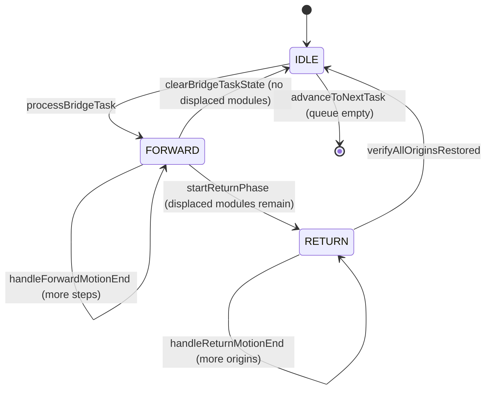

### 12.1 `onMotionEnd` dispatch

```cpp
void Catoms3DFlowBridgeCode::onMotionEnd() {
    switch (currentPhase) {
        case BridgePhase::FORWARD: handleForwardMotionEnd(catom->position); break;
        case BridgePhase::RETURN:  handleReturnMotionEnd (catom->position); break;
        case BridgePhase::IDLE:    /* drop */                                break;
    }
}
```

`catom->position` is the freshly-updated position of the block whose
rotation just ended; the scheduler guarantees the position is settled
before the `MotionEndEvent` fires.

---

## 13. State Machine - `SelectionStage`

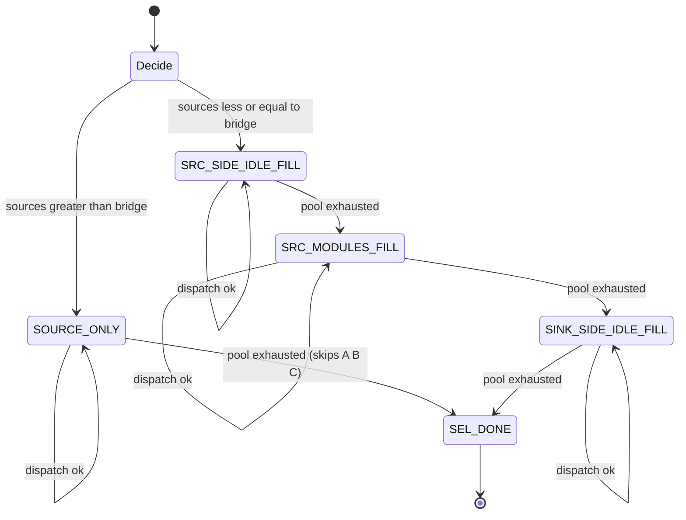

### 13.1 Per-stage strategy table

| Stage | Donor pool | Bridge ordering | Pairing rule |
|---|---|---|---|
| `SOURCE_ONLY` | `sourceModulesPool` | `bridgeSrcMostOrder` (source-most first) | For each target in order, pick donor with shortest `findPathForModule` path; dispatch first feasible match. |
| `SRC_SIDE_IDLE_FILL` (Stage A) | `srcSideIdlePool` | `bridgeSinkMostOrder` (sink-most first) | Same iteration scheme. |
| `SRC_MODULES_FILL` (Stage B) | `sourceModulesPool` | `bridgeSrcMostOrder` (source-most first) | Same iteration scheme. |
| `SINK_SIDE_IDLE_FILL` (Stage C) | `sinkSideIdlePool` | none (closest pairing) | For each remaining empty bridge cell, find the closest available donor by squared Euclidean distance; pick the overall closest feasible `(donor, target)`. |
| `SEL_DONE` | none | none | Forward loop exits. |

### 13.2 Why `SOURCE_ONLY` skips stages A–C

The activity diagram (see `Catoms3DFlowBridgeCode.cpp` around L1496–L1521)
specifies that when `|M| > |B|` the bridge can be filled entirely by
moving blocks. In that branch `advanceSelectionStage` jumps directly
from `SOURCE_ONLY` to `SEL_DONE`, bypassing the idle-module stages.
Stages A → B → C are the alternative branch taken when `|M| <= |B|`.

### 13.3 Distance maps

`distToSource` and `distToSink` are populated by `bfsDistancesFromSet`,
which is a multi-source BFS over `lattice->getNeighborhood`. They are
used twice:

- To classify idle modules into `srcSideIdlePool` / `sinkSideIdlePool`
  (a module `p` is "source side" iff `distToSource[p] <= distToSink[p]`).
- To sort `combinedBridgePositions` into `bridgeSinkMostOrder` and
  `bridgeSrcMostOrder` by ascending distance to the nearest sink /
  source.

The BFS is unweighted (each `getNeighborhood` neighbour costs 1), which
suffices for stage ordering and idle-module classification.

---

## 14. Activity Diagram - `runForwardRound`

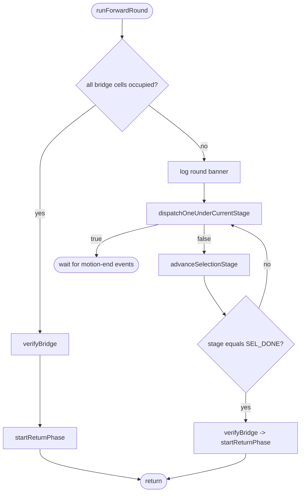

---

## 15. Data-Flow Diagram - Full Pipeline

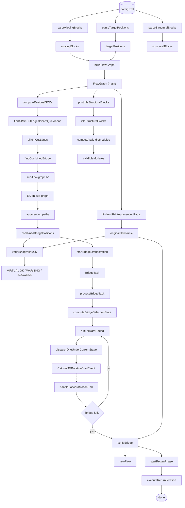

---

## 16. Deployment Diagram and CLI

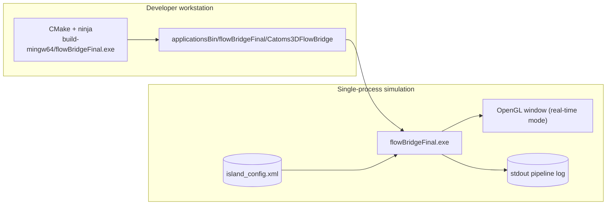

Typical Windows command line (matching the user's local setup):

```bash
cd build-mingw64
cmake ..
ninja flowBridgeFinal.exe
cd ../applicationsBin/flowBridge
../../build-mingw64/flowBridgeFinal.exe -r -l -c island_config.xml
```

Flags interpreted by the VisibleSim base simulator:

| Flag | Meaning |
|---|---|
| `-r` | Enable replay export. |
| `-l` | Enable live OpenGL window (real-time mode). |
| `-t` | Terminal-only mode (skip OpenGL). |
| `-c <path>` | Configuration file path. |
| `-D` | Deterministic seed. |

---

## 17. Phase ↔ Symbol Map

| Phase | Top-level entry | Key helpers | Static state it produces |
|---|---|---|---|
| 1. XML parsing | `startup` | `parseTargetPositions`, `parseMovingBlocks`, `parseStructuralBlocks` | `targetPositions`, `movingBlocks`, `structuralBlocks` |
| 2. Main flow graph build | `FlowGraph::buildFlowGraph` | `getAllPossibleMotionsFromPosition`, `addEdgesRec` | `FlowGraph::nodes` |
| 3. Edmonds–Karp | `FlowGraph::findAndPrintAugmentingPaths` | `backupCapacities` | `originalFlowValue`, `augmentingPathPositions` |
| 4. Picard–Queyranne all-min-cuts | `FlowGraph::findAllMinCutEdgesPicardQueyranne` | `computeResidualSCCs` | `allMinCutEdges` |
| 5. Combined-bridge construction | `FlowGraph::findCombinedBridge` | EK on sub-graph | `combinedBridgePositions`, `combinedBridgePaths` |
| 6. Idle-module filtering | `computeValidIdleModules` | `isModuleBlocked`, `isArticulationPoint` | `validIdleModules` |
| 7. **Virtual bridge verification** | `verifyBridgeVirtually` | phantom Catoms3DBlocks, source removal | none persistent; diagnostic flow prediction |
| 8. Orchestration init | `startBridgeOrchestration` -> `processBridgeTask` | `computeBridgeSelectionState` | `pendingBridges`, `currentBridgeTask`, donor pools |
| 9. Forward dispatch loop | `runForwardRound` -> `dispatchOneUnderCurrentStage` | `findPathForModule`, `Catoms3DRotationStartEvent` | `travelLog`, `placedIntermediates` |
| 10. Per-step advance | `handleForwardMotionEnd` | `forwardVisited`, `findPath` reroute | mutates `travelLog`, `returnTargets` |
| 11. Round completion | `onForwardRoundComplete` | - | `placedIntermediates` |
| 12. Post-bridge verification | `verifyBridge` | new `FlowGraph` + EK | logs `newFlow` |
| 13. Return phase | `startReturnPhase` -> `executeReturnIteration` -> `handleReturnMotionEnd` | `findPathForModule` | drains `pendingOrigins` |
| 14. Finalisation | `verifyAllOriginsRestored`, `clearBridgeTaskState`, `advanceToNextTask` | - | clears all per-task state |

---

## 18. Phantom-Module Engineering

### 18.1 Object diagram of a phantom

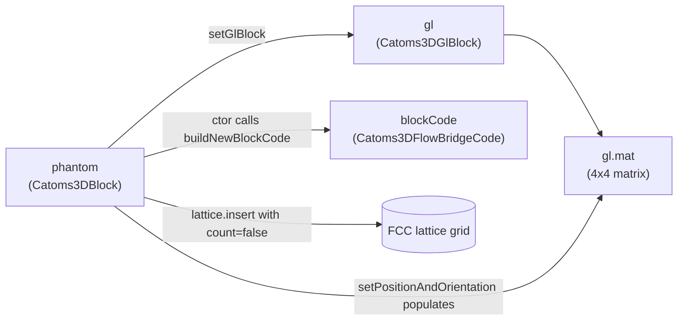

### 18.2 Construction recipe (annotated)

```cpp
// (a) Choose an ID outside the live range to avoid collisions.
bID phantomIdBase = ... + 1000000;

// (b) Allocate the catom. BuildingBlock's ctor calls buildNewBlockCode,
//     which creates a Catoms3DFlowBridgeCode but does NOT re-run startup
//     because of the hasRun guard.
auto* phantom = new Catoms3DBlock(id, Catoms3DFlowBridgeCode::buildNewBlockCode);

// (c) Allocate a Catoms3DGlBlock. The motion engine unconditionally
//     dereferences ((Catoms3DGlBlock*)ptrGlBlock)->mat inside
//     getConnectorId and getNeighborPos. Without this allocation the
//     motion engine would segfault.
auto* gl = new Catoms3DGlBlock(id);
phantom->setGlBlock(gl);

// (d) Populate the rotation matrix. updateGlData is null-safe with
//     respect to GlBlock-less catoms, but here gl is valid so the
//     matrix is correctly written.
phantom->setPositionAndOrientation(pos, 0);

// (e) Insert into the lattice WITHOUT bumping nbModules.
lattice->insert(phantom, pos, /*count=*/false);
```

### 18.3 What the phantom does NOT have

- No entry in `Catoms3DWorld::buildingBlocksMap`.
- No entry in `Catoms3DWorld::mapGlBlocks`.
- No `CodeStartEvent` scheduled.
- No `linkBlock` neighbour wiring (the motion engine reads positions
  directly from the lattice; the P2P neighbourhood is not consulted).
- No persistence past `verifyBridgeVirtually` - both the catom and the
  GlBlock are `delete`d at teardown.

### 18.4 Why `count=false` is critical

The base `Lattice::insert` interprets its third argument as "*also
update `nbModules`?*". Live simulations rely on `nbModules` for
end-of-simulation accounting and replay export. Passing `false`
suppresses the increment, so the verifier's transient activity is
invisible to those subsystems.

### 18.5 Teardown order

```text
1. Run Edmonds-Karp; collect virtualFlow.
2. For each phantom: lattice.remove(phantom.position, count=false).
3. Delete each phantom and its GlBlock.
4. For each savedSource: lattice.insert(mod, pos, count=false).
5. Clear savedSources and phantoms vectors.
```

**Order matters**: phantoms must be removed *before* sources are
re-inserted, because some source positions may coincide with bridge
cells in pathological configurations and a `DoubleInsertionException`
would be thrown otherwise. (The current canonical configurations
don't trigger this, but the code is written defensively.)

---

## 19. Concrete Walkthrough on `island_config.xml`

This section walks through the live behaviour of the application on
the supplied benchmark. Values are taken from a real run logged during
development.

### 19.1 Configuration summary

| Group | Cells |
|---|---|
| `targetPositions` | 16 cells at `(11..14, 1..4, 1)` |
| `movingBlocks` | 16 cells at `(1..4, 1..4, 1)` |
| `structuralBlocks` | 54 cells: two 5x5 plates at z=0 (`(1..5, 1..5, 0)` and `(11..15, 1..5, 0)`) plus the connecting bar `(6..10, 3, 0)` |

### 19.2 Phase 3 (Edmonds–Karp on main graph)

```
Augmenting path 1: SUPER_SOURCE -> 4,1,1 -> 5,1,1 -> 6,2,0 -> 6,2,1 -> 7,2,1 -> 8,2,1 -> 9,2,1 -> 10,2,1 -> 11,2,1 -> SUPER_SINK
Augmenting path 2: SUPER_SOURCE -> 4,1,1 -> 5,2,2 -> 5,2,1 -> 6,2,1 -> 7,3,1 -> 8,3,1 -> 9,3,1 -> 10,3,1 -> 11,3,1 -> SUPER_SINK
Augmenting path 3: SUPER_SOURCE -> 4,4,1 -> 5,4,1 -> 6,4,0 -> 6,3,1 -> 7,3,1 -> 8,2,1 -> 9,3,1 -> 10,2,1 -> 11,1,1 -> SUPER_SINK
Augmenting path 4: SUPER_SOURCE -> 4,4,1 -> 5,4,2 -> 5,3,1 -> 6,3,1 -> 7,2,1 -> 8,3,1 -> 9,2,1 -> 10,3,1 -> 11,2,1 -> SUPER_SINK
Augmenting path 5: SUPER_SOURCE -> 3,1,1 -> 4,2,2 -> 5,3,2 -> 5,2,1 -> 6,3,1 -> 7,4,0 -> 7,3,1 -> 8,4,0 -> 8,3,1 -> 9,4,0 -> 9,3,1 -> 10,4,0 -> 10,4,1 -> 11,4,1 -> SUPER_SINK
Augmenting path 6: SUPER_SOURCE -> 3,4,1 -> 4,4,2 -> 5,3,2 -> 5,3,1 -> 6,2,1 -> 7,2,0 -> 7,2,1 -> 8,2,0 -> 8,2,1 -> 9,2,0 -> 9,2,1 -> 10,2,0 -> 10,2,1 -> 11,3,1 -> SUPER_SINK
=> originalFlowValue = 6
```

### 19.3 Phase 4 (Picard–Queyranne)

The residual graph has 17 SCCs; the union of min-cut arcs contains 36
edges spanning the `x = 6 .. 9` region. Sample entries:

```
Min-cut edge: 6,2,1 -> 7,2,0  [SCC 6 -> SCC 7]
Min-cut edge: 6,2,1 -> 7,2,1  [SCC 6 -> SCC 9]
...
Min-cut edge: 8,2,1 -> 9,3,1  [SCC 12 -> SCC 15]
36 min-cut arc(s) in union (Picard-Queyranne).
```

### 19.4 Phase 5 (combined bridge)

```
|tails (source-most)| = 4, |heads (sink-most)| = 4, |min-cut arcs| = 36
Sub-graph built: 85 node(s).
6 augmenting path(s) in combined sub-graph.
Combined bridge size: 14 empty cell(s) to fill (skipped 0 already-occupied path cell(s)).
Bridge positions: (6,2,1) (6,3,1) (7,2,0) (7,2,1) (7,3,1) (7,4,0)
                  (8,2,0) (8,2,1) (8,3,1) (8,4,0) (9,2,0) (9,2,1)
                  (9,3,1) (9,4,0)
```

### 19.5 Phase 6 (idle-module filtering)

The structural plates at z=0 contain many idle candidates; the BFS-based
articulation test removes the ones whose removal would disconnect the
remaining structure. Final counts:

```
42 idle structural block(s).
14 valid idle module(s).
```

### 19.6 Phase 7 (virtual verification, expected output)

```
=== [Virtual Bridge Pre-Verification] ===
  Combined bridge has 14 cell(s).  Inserting phantom modules and re-running Edmonds-Karp
  on the resulting lattice state (baseline flow = 6).
  Virtually moved 14 of 16 source module(s) (closest to the bridge) out of their original positions.
  Inserted 14 phantom module(s) at bridge cells.
  Lattice phantom visibility: 14 ok, 0 missing.
  Phantom-pivoted motion links (over all bridge cells, with multiplicity): 542
  Per-source one-step reachable counts:
    (1,1,1) -> 0 ...    [removed]
    (1,2,1) -> 0 ...    [removed]
    (1,3,1) -> 2 ...    [retained]
    (1,4,1) -> 6 ...    [retained]
    ...
  Building virtual FlowGraph...
  Virtual FlowGraph node count: 97
  Super-source out-edges (positive cap): 16
  Super-sink   in-edges  (positive cap): 16
  BFS reachable from SUPER_SOURCE: <large>. SUPER_SINK IS reachable.

--- Edmonds-Karp Augmenting Paths ---
Augmenting path 1: SUPER_SOURCE -> 4,1,1 -> 5,2,1 -> 6,1,1 -> 7,1,1 -> 8,1,1 -> 9,1,1 -> 10,2,1 -> 11,2,1 -> SUPER_SINK
... (typically 8 paths, matching post-bridge verifyBridge)

  [Virtual Flow Result]
    Baseline (no bridge)        = 6
    Virtual (bridge as if built)= 8
  [VIRTUAL OK] Building the bridge WILL increase flow (6 -> 8).
```

### 19.7 Phase 8–9 (orchestration + post-bridge verifyBridge)

The selection state machine begins in `SOURCE_ONLY` because
`|sources| = 16 > 14 = |bridge|`. 14 rounds dispatch one moving block
each, in the same order as the verifier's source-removal heuristic:

```
=== [Bridge Round 1] 14 / 14 ...
  [DISPATCH/SOURCE_ONLY] Module (4,1,1) -> bridge cell (6,2,1) (3 step(s))
  [ARRIVED] ...
  [PLACED] ...
=== [Bridge Round 14] 1 / 14 ...
  [DISPATCH/SOURCE_ONLY] Module (1,2,1) -> bridge cell (9,4,0) (8 step(s))
```

`verifyBridge` then logs:

```
Flow increased: 6 -> 8. Bridge successful!
```

confirming the virtual-verifier prediction.

---

## 20. Diagnostic Output Cheat Sheet

| Log line | Meaning | Common cause if anomalous |
|---|---|---|
| `Lattice phantom visibility: <ok> ok, <bad> missing.` | Every phantom is in the grid. | A non-zero `missing` value means a phantom failed insertion silently. |
| `Phantom-pivoted motion links ... : <L>` | Number of motion possibilities through phantom pivots. | `L = 0` indicates a motion-engine breakage - usually missing `GlBlock`. |
| `Per-source one-step reachable counts:` | Per-source reachable cells under the modified lattice. | All zeros means the source-removal step removed the entire moving-block set. |
| `Virtual FlowGraph node count: <V>` | Vertices in the virtual graph. | Should be close to the baseline node count. |
| `Super-source out-edges (positive cap): <S>` | Should equal `|movingBlocks|`. | Less means an unintended deduplication / hash collision. |
| `Super-sink in-edges (positive cap): <T>` | Should equal `|targetPositions|`. | Less means a target was unreachable in the build phase. |
| `BFS reachable from SUPER_SOURCE: <R>` | Vertices reachable from the super-source through positive-capacity edges. | Small `R` indicates the source side is islanded - usually fixed by larger configurations. |
| `SUPER_SINK IS NOT reachable.` | No augmenting path will be found. | The geometry genuinely admits no path even with the bridge; or a phantom is mis-configured. |
| `[VIRTUAL OK] Building the bridge WILL increase flow (X -> Y).` | The bridge will help. | - |
| `[VIRTUAL SUCCESS] Virtual flow Y >= expected X+K` | Flow reaches the naive upper bound. | - |
| `[VIRTUAL INFO] Virtual flow Y < expected X+K` | Bridge bypasses only some min-cut arcs. | Expected on most real geometries. |
| `[VIRTUAL WARNING] Building the bridge does NOT increase flow` | Flow unchanged. | The bridge construction is degenerate. |
| `[VIRTUAL ERROR] Virtual flow Y < baseline X` | Flow decreased. | A code bug - should not happen given correct phantom geometry. |

---

## 21. Build, Run, and XML Schema

### 21.1 CMake / ninja (canonical)

```bash
cmake -S . -B build-mingw64 -G Ninja
cmake --build build-mingw64 --target flowBridgeFinal.exe
./build-mingw64/flowBridgeFinal.exe -r -l -c applicationsBin/flowBridge/island_config.xml
```

### 21.2 POSIX make (fallback)

```bash
cd applicationsSrc/flowBridgeFinal
make
../../applicationsBin/flowBridgeFinal/Catoms3DFlowBridge -r -l -c island_config.xml
```

### 21.3 XML schema (subset relevant to this app)

```xml
<world ...>
  <targetList>
    <target>
      <cell position="11,1,1"/>
      <!-- more cells -->
    </target>
  </targetList>

  <movingBlocks>
    <block position="1,1,1" color="#00CC00" orientation="0"/>
    <!-- more blocks -->
  </movingBlocks>

  <blockList>
    <block position="1,1,0" orientation="0"/>
    <!-- more blocks -->
  </blockList>
</world>
```

Notes:

- `parseStructuralBlocks` removes any cell that already appears in
  `movingBlocks`, so a cell listed in both `blockList` and
  `movingBlocks` is counted as a moving block only.
- All blocks in `island_config.xml` use `orientation="0"`. The phantom
  insertion uses the same orientation; the connector-id arithmetic is
  insensitive to translation but does depend on orientation, so
  mixing orientations in user configurations is permitted but the
  virtual verifier may need re-tuning of the heuristic.

---

## 22. Extension Points and Variation Recipes

### 22.1 Replacing the donor heuristic

The motion machinery (`findPathForModule`,
`Catoms3DRotationStartEvent`, `handleForwardMotionEnd`) is *decoupled*
from donor selection. To plug in a new strategy:

1. Add a new value to the `SelectionStage` enum.
2. Extend the `switch` inside `dispatchOneUnderCurrentStage` with the
   donor pool and target ordering for the new stage.
3. Extend `advanceSelectionStage` so the state graph transitions into
   and out of your stage.

### 22.2 Replacing the bridge geometry

Override `FlowGraph::findCombinedBridge`. The orchestration consumes
only `combinedBridgePositions`; the algorithm that fills that vector is
fully pluggable. Examples:

- One bridge per min-cut arc (the original brute-force variant).
- A Steiner-tree-like minimal bridge.
- A learned policy fed by a separate planner.

### 22.3 Replacing the virtual verifier

`verifyBridgeVirtually()` is self-contained. Plug in a different
predictor (e.g., a cached prediction from a previous run, an analytic
bound, an ML inference) by replacing the function body and keeping the
same outward log format so downstream tooling still parses it.

### 22.4 Multi-task pipelines

`pendingBridges` is already a `std::queue<BridgeTask>`, and the
orchestration calls `advanceToNextTask()` at the end of each task. To
process multiple bridges sequentially:

1. In `startBridgeOrchestration()`, push more than one `BridgeTask`.
2. The rest of the pipeline iterates them automatically via
   `advanceToNextTask` -> `processBridgeTask` -> `runForwardRound`.

### 22.5 Adding a new pre-orchestration phase

The startup pipeline runs strictly sequentially. To insert a new phase
(e.g., a cost estimate for the upcoming dispatch), splice a function
call between `verifyBridgeVirtually()` and `startBridgeOrchestration()`
in `startup()`. Add its static state to `clearBridgeTaskState` if it
must be reset between tasks.

---

## 23. Frequently Asked Questions

**Q: Why is the virtual verifier called once, not once per task?**
**A:** `pendingBridges` always carries a single task in the Final
variant (a single combined bridge). The verifier is co-located with the
analysis pipeline; if multi-task support is added, the verifier can be
called per task by moving the call into `processBridgeTask`.

**Q: Can I verify the bridge after orchestration without the virtual
phase?**
**A:** Yes - that is exactly what `verifyBridge()` already does. The
virtual verifier is a *prediction* step that runs *before* any motion
event is scheduled.

**Q: Why are phantom IDs offset by 1,000,000?**
**A:** Defensive. The verifier never registers phantoms in
`buildingBlocksMap`, so collisions are unlikely. The offset makes
phantom IDs trivially distinguishable in log output and gracefully
handles configurations with unusually large `maxBlockId`.

**Q: Could I skip allocating a GlBlock for the phantom?**
**A:** No. `Catoms3DBlock::getConnectorId` (in
`simulatorCore/src/robots/catoms3D/catoms3DBlock.cpp` around line 183)
unconditionally dereferences `((Catoms3DGlBlock*)ptrGlBlock)->mat`.
Without the GlBlock the very first motion-engine call segfaults.

**Q: Why pass `count=false` to `lattice->insert`?**
**A:** To prevent `nbModules` from being incremented. `nbModules` is
read by the end-of-simulation accounting and the replay exporter; the
verifier's transient activity must be invisible to them.

**Q: What if `validIdleModules` is empty and `|M| <= |B|`?**
**A:** The state machine enters `SRC_SIDE_IDLE_FILL` first, finds an
empty donor pool, advances to `SRC_MODULES_FILL`, uses source modules,
and finally tries `SINK_SIDE_IDLE_FILL` (also empty). The forward loop
then exits without filling all bridge cells; `verifyBridge` reports
`[MISSING]` for the unfilled cells and the flow comparison shows the
shortfall.

**Q: Can I run the verifier on `Catoms_3D_Flow_Bridge_Combined_Min_Cut_Edge`?**
**A:** Not as-is, because that variant lacks the `verifyBridgeVirtually`
method. Porting is straightforward: copy the function body into the
older variant's `Catoms3DFlowBridgeCode.cpp`, add the prototype in the
header, and call it from `startup()` between `computeValidIdleModules`
and `startBridgeOrchestration`.

**Q: Does the verifier work with non-FCC lattices?**
**A:** The verifier only depends on `getNeighborhood`,
`getFreeNeighborCells`, `getActiveNeighborCells`, `getBlock`, `insert`,
`remove`, `isInGrid`, `isFree`. As long as the lattice exposes those
operations and the motion engine consults them, the verifier is
lattice-agnostic. The orientation code 0 used for phantoms is FCC-
specific; another lattice would need its own canonical orientation.
